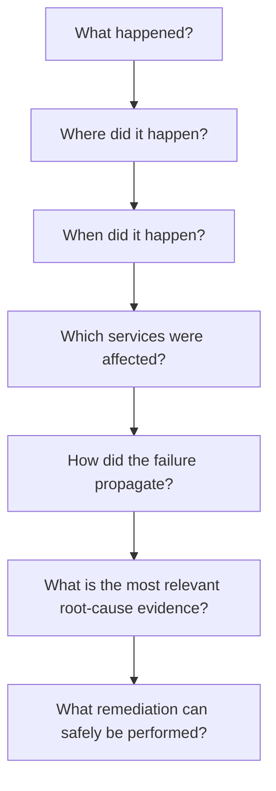
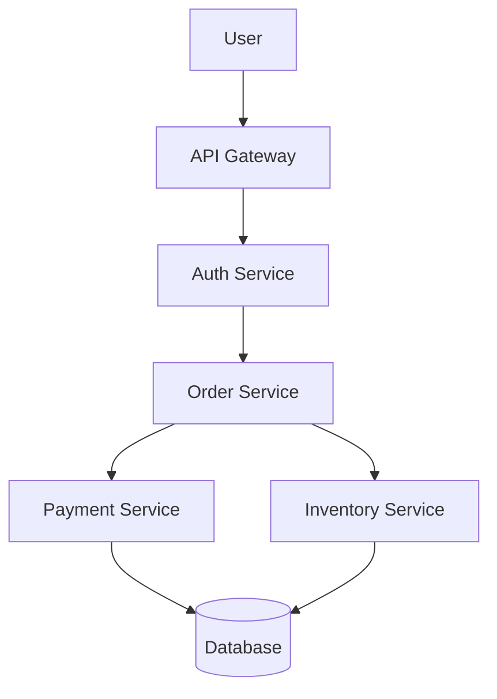
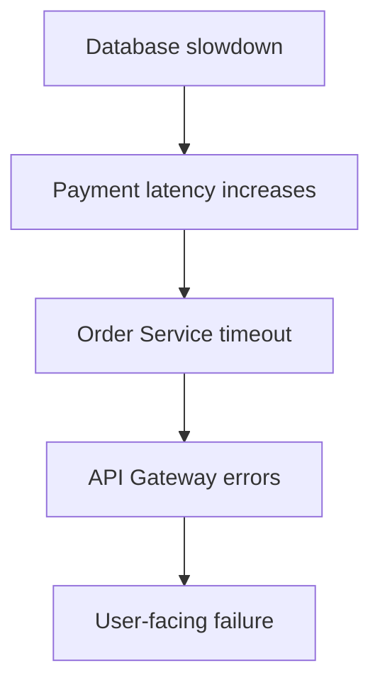
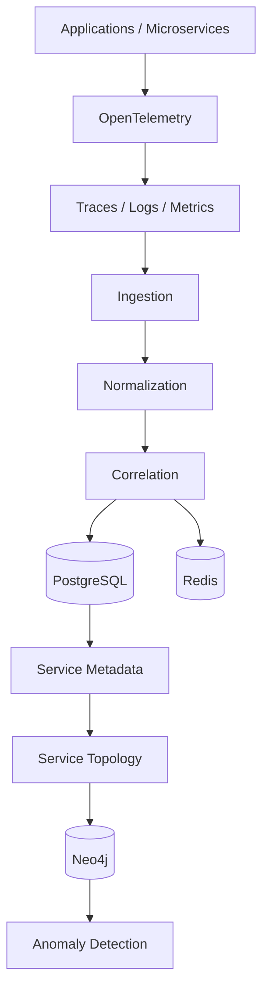
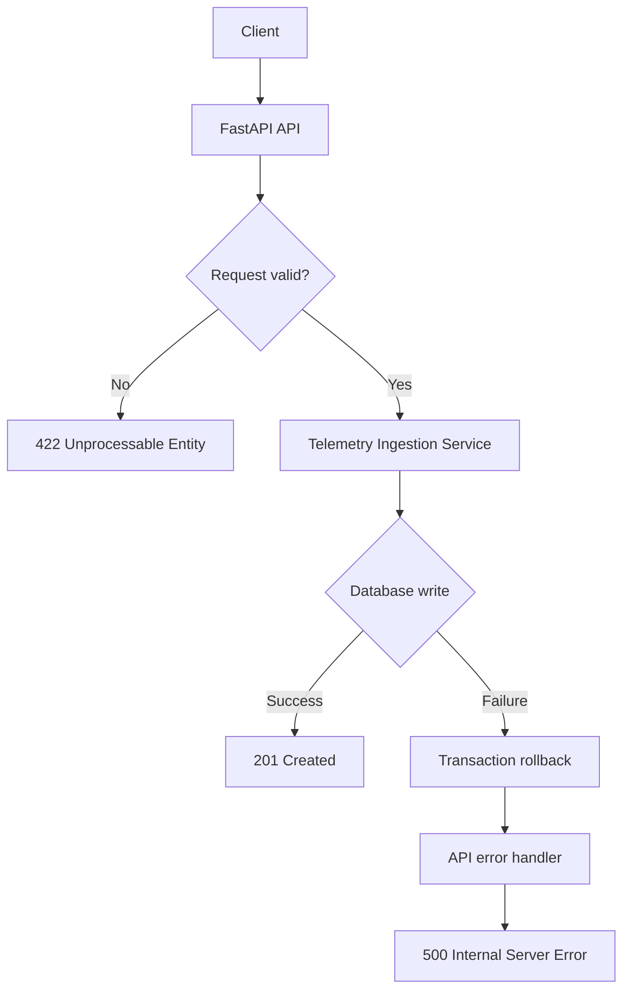

# TraceRCA AI

**Distributed OpenTelemetry Multi-Layer Causal Inference & Auto-Healing Engine**

TraceRCA AI is an observability and root-cause-analysis (RCA) platform for distributed, microservice-based systems. It connects traces, logs, metrics, and topology into a single evidence chain, so that the *actual* cause of a failure can be found, explained, and safely remediated.

---

## Table of Contents

- [Overview](#overview)
- [Key Capabilities](#key-capabilities)
- [Project Vision](#project-vision)
- [Architecture](#architecture)
- [Project Status](#project-status)
- [M5 — Telemetry Ingestion API](#m5--telemetry-ingestion-api)
- [Project Structure](#project-structure)
- [Getting Started](#getting-started)
- [Testing](#testing)

---

## Overview

Modern systems can contain dozens or hundreds of interconnected services. When something fails, the visible error is rarely the real cause. TraceRCA AI is built to answer the full chain of incident questions:



## Key Capabilities

| Area | Capability |
|---|---|
| **Telemetry** | OpenTelemetry traces, application logs, infrastructure metrics |
| **Context** | Service metadata, service dependency graphs, deployment and configuration changes |
| **Correlation** | Incident and alert correlation, temporal dependency analysis |
| **Intelligence** | Causal inference, Graph RAG, evidence-based root-cause analysis |
| **Impact** | Blast-radius analysis |
| **Action** | Remediation recommendations, controlled auto-healing |

---

## Project Vision

A single user request can travel through many components:



When a failure occurs, the visible symptom may sit far from the underlying cause. For example:



Traditional monitoring shows each of these signals separately. TraceRCA AI connects them and preserves the relationships required for deeper analysis.

### Core Problem

Distributed systems produce many kinds of operational data:

- Distributed traces
- Application logs
- Infrastructure metrics
- Service metadata and dependency relationships
- Alerts and incident information
- Deployment and configuration changes

The challenge is not collecting this data. It is **understanding** it: correlating signals across services and time to find the root cause and decide what can be fixed safely.

---

## Architecture

The project is delivered in three parts:

| Part | Name | Focus |
|---|---|---|
| **Part 1** | Observability Foundation | Ingest, normalize, and correlate telemetry; build service topology; detect anomalies |
| **Part 2** | AI Root Cause Intelligence | Causal inference, Graph RAG, evidence-based RCA, blast-radius analysis |
| **Part 3** | Auto-Healing & Production | Remediation recommendations, controlled auto-healing, production hardening |

### Part 1 — Observability Foundation

Part 1 produces reliable, structured information for the AI intelligence layer to consume.



**Expected output of Part 1:** Telemetry → Normalized Events → Correlated Events → Service Topology → Anomalies.

---

## Project Status

**Active development — Part 1 (Observability Foundation).**

| Part | Status |
|---|---|
| Part 1 — Observability Foundation | 🔄 In progress (currently on M5) |
| Part 2 — AI Root Cause Intelligence | ⏳ Planned |
| Part 3 — Auto-Healing & Production | ⏳ Planned |

---

## M5 — Telemetry Ingestion API

**Status:** 🔄 In progress

The Telemetry Ingestion API is the entry point for telemetry from OpenTelemetry-enabled services. It validates incoming data, converts it into the internal `TelemetryEvent` model, and persists it to PostgreSQL.

### Endpoints

| Method | Endpoint | Purpose |
|---|---|---|
| `POST` | `/telemetry/traces` | Ingest trace spans |
| `POST` | `/telemetry/logs` | Ingest application logs |
| `POST` | `/telemetry/metrics` | Ingest infrastructure metrics |

### Request Flow



### Milestone Progress

| Step | Description | Status |
|---|---|---|
| M5.1 | Inspect M4 and freeze telemetry contracts | ✅ Complete |
| M5.2 | Create Pydantic telemetry ingestion schemas | ✅ Complete |
| M5.3 | Implement telemetry ingestion service | ✅ Complete |
| M5.4 | Implement `POST /telemetry/traces` | ✅ Complete |
| M5.5 | Implement `POST /telemetry/logs` | ✅ Complete |
| M5.6 | Implement `POST /telemetry/metrics` | ✅ Complete |
| M5.7 | Connect ingestion service to PostgreSQL and add tests | ✅ Complete |
| M5.8 | Error handling and validation | ✅ Complete |
| M5.9 | Unit and API tests | ⏳ Pending |
| M5.10 | OpenTelemetry integration test | ⏳ Pending |

### M5.8 — Error Handling & Validation

M5.8 adds schema validation, service-level error handling, API-level exception handling, and consistent error responses across all three endpoints.

#### Schema Validation

Validation is enforced with Pydantic. Whitespace-only values are rejected for important string fields, maximum lengths are enforced on identifiers and messages, and flexible OpenTelemetry attributes are preserved.

| Signal | Rules |
|---|---|
| **Traces** | `trace_id`, `span_id`, `service_name`, `operation_name` must be non-empty; optional parent span ID has a maximum length; `duration_ms` must not be negative; `status` must be `UNSET`, `OK`, or `ERROR` |
| **Logs** | `service_name` and `message` must be non-empty; maximum message length; timestamp must be valid |
| **Metrics** | `service_name` and `metric_name` must be non-empty and valid; `metric_value` must be numeric; timestamp must be valid |

Invalid requests return `422 Unprocessable Entity`.

### M6.1 — Inspect M5 Output and Freeze Normalization Contract

**Status: 🔄 In Progress**

Inspected the telemetry data produced by M5 and compared the ingestion schemas, SQLAlchemy models, and actual PostgreSQL database structure.

#### Findings

The existing `telemetry_events` table successfully stored:

- `event_type`
- `timestamp`
- `service_name`
- `trace_id`
- `span_id`
- `parent_span_id`
- `message`
- `metric_name`
- `metric_value`
- `attributes`
- `created_at`

However, the trace ingestion schema already contained three important fields that were not being persisted in the database:

- `operation_name`
- `duration_ms`
- `status`

These fields are important for the later RCA pipeline because they provide:

- **operation_name** → identifies the failing or slow operation
- **duration_ms** → enables latency and performance analysis
- **status** → enables error/failure detection

#### Schema Update

Updated the `TelemetryEvent` SQLAlchemy model with:

```text
operation_name VARCHAR(255)
duration_ms FLOAT
status VARCHAR(50)

Database Migration
Generated and applied Alembic migration:
c0ebede2393f_add_trace_fields_to_telemetry_events.py

Migration:
ce12331ef2cd → c0ebede2393f

PostgreSQL verification confirmed that the three new columns are present in telemetry_events.
Verification
Existing log and metric records were checked after migration.
The new fields correctly appear as:
operation_name = None
duration_ms = None
status = None

for historical records created before the schema update.
Remaining work: Update the trace ingestion service so new trace events persist operation_name, duration_ms, and status.

#### Database Error Handling

The ingestion service handles SQLAlchemy errors and operating-system/database connection errors. On failure it:

1. Rolls back the active transaction, so no partial writes are left behind.
2. Re-raises the original exception.
3. Lets the API layer translate it into a consistent client response, without exposing internal database details.

#### Error Response Contract

All three endpoints return the same structure on persistence failure:

```http
HTTP/1.1 500 Internal Server Error
```

```json
{
  "detail": "Failed to persist telemetry event"
}
```

| Scenario | Status Code |
|---|---|
| Event stored successfully | `201 Created` |
| Invalid request payload | `422 Unprocessable Entity` |
| Database / persistence failure | `500 Internal Server Error` |

#### M5.8 Checklist

- [x] M5.8.1 Inspect current validation and error behavior
- [x] M5.8.2 Strengthen Pydantic schema validation
- [x] M5.8.3 Add service-level database error handling
- [x] M5.8.4 Add API-level exception handling
- [x] M5.8.5 Test invalid trace requests
- [x] M5.8.6 Test invalid log requests
- [x] M5.8.7 Test invalid metric requests
- [x] M5.8.8 Test database failure handling
- [x] M5.8.9 Verify consistent API error responses
- [x] M5.8.10 Run final verification


M6.2
  │
  ├── 1. Design normalized fields
  ├── 2. Decide data types
  ├── 3. Decide optional/required fields
  ├── 4. Define event-type behavior
  └── 5. Freeze the schema contract

  Define Normalized Telemetry Schema
This is our next step.
Goal
We will define one common internal schema that all three telemetry types will eventually follow:
Trace ──┐
Log   ──┼──> NormalizedTelemetry
Metric ─┘

Instead of letting the RCA engine deal with three different raw formats, it will receive a predictable structure.
What we'll define
For M6.2, we'll decide the normalized representation for:
1. Identity
   - event_id
   - event_type
2. Timing
   - timestamp
   - duration_ms
3. Service information
   - service_name
   - operation_name
4. Distributed tracing
   - trace_id
   - span_id
   - parent_span_id
5. Status
   - status
6. Payload
   - message
   - metric_name
   - metric_value
7. Metadata
   - attributes
The important thing is that we won't code yet.
First we'll freeze the contract: field → type → required/optional → meaning → which telemetry types use it.


NormalizedTelemetry
│
├── event_id           UUID                 required
├── event_type         trace/log/metric     required
├── timestamp          datetime             required
├── service_name       string               required
│
├── operation_name     string | None
├── trace_id           string | None
├── span_id            string | None
├── parent_span_id     string | None
├── duration_ms        float | None
├── status             UNSET/OK/ERROR | None
│
├── message            string | None
├── metric_name        string | None
├── metric_value       float | None
│
└── attributes         dict[str, Any]       required


So the architecture becomes:
Raw M5 Telemetry
       ↓
PostgreSQL TelemetryEvent
       ↓
M6 Normalization
       ↓
NormalizedTelemetry
       ↓
Future RCA / Correlation / Causal Analysis

for normalized schmma for traces metrics and log 
Validation tests
Now we need to make sure the schema rejects invalid data, not just accepts valid data.
We'll test:
1. Invalid event_type
2. Negative duration_ms
3. Empty service_name
4. Invalid status
5. Empty message


M6.2 — Define Normalized Telemetry Schema

M6.2.1  Design normalized fields              ✅
M6.2.2  Define validation rules               ✅
M6.2.3  Implement NormalizedTelemetry         ✅
M6.2.4  Verify schema                         ✅
M6.2.5  Add validation tests                  ✅


Instead of creating three completely separate normalized schemas:
TraceNormalizedSchema
LogNormalizedSchema
MetricNormalizedSchema

we created one common normalized schema:
              NormalizedTelemetry
               /       |       \
            Trace      Log     Metric

This gives the later RCA pipeline one predictable structure to work with.
And yes, we added validation
The schema checks things such as:
- event_type → must be trace, log, or metric
- service_name → required and cannot be empty/whitespace
- duration_ms → cannot be negative
- status → must be UNSET, OK, or ERROR
- message → cannot be empty if provided
- metric_name → string with length limits
- IDs → optional strings with length limits
- attributes → dictionary
For example:
duration_ms = -10
       ↓
    ❌ rejected

and:
event_type = "something_else"
       ↓
    ❌ rejected

One important correction
You said "instead of creating multiple schemas for the raw telemetry data".
More precisely:
M5 already has separate schemas for RAW ingestion:
TraceIngestRequest
LogIngestRequest
MetricIngestRequest

We didn't remove those.
Instead, M6 introduces one common schema AFTER ingestion:
                 M5
                  ↓
       ┌──────────┼──────────┐
       ↓          ↓          ↓
     Trace       Log       Metric
     Schema      Schema     Schema
       │          │          │
       └──────────┼──────────┘
                  ↓
                 M6
                  ↓
       NormalizedTelemetry
                  ↓
          RCA / Correlation

So the key idea is:
Different raw input formats → one common normalized internal format → downstream RCA components.


✅ M6.2 is now functionally complete.
9 passed in 0.36s

What those 9 tests confirmed
- ✅ Valid NormalizedTelemetry objects are accepted
- ✅ Invalid event_type is rejected
- ✅ Negative duration_ms is rejected
- ✅ Empty service_name is rejected
- ✅ Invalid status is rejected
- ✅ Empty message is rejected
- ✅ Trace telemetry fits the common schema
- ✅ Log telemetry fits the common schema
- ✅ Metric telemetry fits the common schema

Telemetry Normalization
Total: 8 major steps
Step	Work	Status
M6.1	Inspect M5 output and freeze normalization contract	✅ Complete
M6.2	Define normalized telemetry schema	✅ Complete
M6.3	Implement trace normalization	⏳ Next
M6.4	Implement log normalization	⏳
M6.5	Implement metric normalization	⏳
M6.6	Implement normalization service/pipeline	⏳
M6.7	Add normalization tests	⏳
M6.8	Final verification + README closeout	⏳


What each remaining step means
M6.3 — Trace Normalization
Raw Trace
   ↓
TraceIngestRequest / DB event
   ↓
Trace Normalizer
   ↓
NormalizedTelemetry

We'll convert the raw trace fields into our common format.
M6.4 — Log Normalization
Raw Log
   ↓
Log Normalizer
   ↓
NormalizedTelemetry

M6.5 — Metric Normalization
Raw Metric
   ↓
Metric Normalizer
   ↓
NormalizedTelemetry

M6.6 — Normalization Service/Pipeline
We'll create the central component that determines:
event_type
    ↓
trace → trace normalizer
log   → log normalizer
metric → metric normalizer
    ↓
NormalizedTelemetry

M6.7 — Normalization Tests
We'll test the actual normalization process, not just the Pydantic schema.
For example:
Raw Trace
   ↓
normalize_trace()
   ↓
NormalizedTelemetry
   ↓
verify every field

Same for logs and metrics.
M6.8 — Final Verification + README
We'll run the complete test suite, verify the normalization pipeline, update the README, and create the final M6 Git checkpoint.
Overall M6 architecture
                 M5 RAW TELEMETRY
                       │
          ┌────────────┼────────────┐
          ↓            ↓            ↓
        Trace         Log         Metric
          │            │            │
          ↓            ↓            ↓
     M6.3           M6.4         M6.5
     Normalize      Normalize    Normalize
          │            │            │
          └────────────┼────────────┘
                       ↓
              NormalizedTelemetry
                       │
                       ↓
              M6.6 Normalization
                  Service/Pipeline
                       │
                       ↓
                  M6.7 Tests
                       │
                       ↓
                  M6.8 Closeout

So M6 has 8 major steps, and you've completed 2/8.

Implement Trace Normalization. 🚀
M6.3 goal
We currently have:
Raw Trace
   ↓
TraceIngestRequest
   ↓
PostgreSQL TelemetryEvent

Now we need:
TelemetryEvent
      ↓
Trace Normalizer
      ↓
NormalizedTelemetry

The important point is that we are not changing the database again. We already have the fields we need from M6.1.
M6.3 will have these small steps
Step	Task
M6.3.1	Design the trace normalization mapping
M6.3.2	Implement normalize_trace()
M6.3.3	Verify normalized trace output
M6.3.4	Test edge cases
M6.3.5	Complete M6.3 and checkpoint


First: M6.3.1 — Trace mapping
Our mapping will be:
TelemetryEvent              NormalizedTelemetry
────────────────────────────────────────────────
id                    →     event_id
event_type            →     event_type
timestamp             →     timestamp
service_name          →     service_name
operation_name        →     operation_name
trace_id              →     trace_id
span_id               →     span_id
parent_span_id        →     parent_span_id
duration_ms           →     duration_ms
status                →     status
attributes             →     attributes

Fields such as:
message
metric_name
metric_value

will remain:
None


because they aren't applicable to a trace.
So a database record like:
service_name  = payment-service
operation     = process-payment
duration      = 245.5
status        = ERROR
trace_id      = abc123
span_id       = span456

becomes:
NormalizedTelemetry(
    event_type="trace",
    service_name="payment-service",
    operation_name="process-payment",
    duration_ms=245.5,
    status="ERROR",
    trace_id="abc123",
    span_id="span456",
)

What this function does
It takes:
TelemetryEvent

and produces:
NormalizedTelemetry

The transformation is essentially:
Database Trace
      │
      │ normalize_trace()
      ↓
NormalizedTelemetry

Why this check is important
We added:
if event.event_type != "trace":    raise ValueError("Expected a trace telemetry event")


This prevents us from accidentally passing a log or metric into the trace normalizer.
For example:
Log event
   ↓
normalize_trace()
   ↓
❌ ValueError

while:
Trace event
   ↓
normalize_trace()
   ↓
✅ NormalizedTelemetry

**#### Verification Result**

```bash
pytest -q tests/test_trace_normalizer.py tests/test_normalized_telemetry.py

**13 tests passed.** This confirmed that trace telemetry is correctly transformed from the persisted TelemetryEvent representation into the common NormalizedTelemetry structure; that all trace fields are preserved; that non-trace events are rejected by the trace normalizer; and that missing optional fields and attributes are handled safely.
---
#### Verification Result

```bash
pytest -q tests/test_ingestion_service.py tests/test_telemetry_api.py
```

**16 tests passed.** This confirmed that schema validation works for traces, logs, and metrics; that database errors are handled and rolled back at the service layer; that all endpoints return the same 500 response on persistence failure; and that existing ingestion functionality is unaffected.

---


pytest -q tests/test_ingestion_service.py tests/test_telemetry_integration.py

**7 tests passed.** This confirmed that the updated trace ingestion service correctly persists operation_name, duration_ms, and status; that existing log and metric ingestion functionality remains unaffected; and that the OpenTelemetry trace successfully flows through the ingestion pipeline and is persisted to PostgreSQL.

## Project Structure

```text
TraceRCA-AI/
├── backend/
│   ├── __init__.py
│   ├── app/
│   │   ├── __init__.py
│   │   ├── main.py
│   │   ├── api/
│   │   │   └── routes/
│   │   │       └── health.py
│   │   ├── cache/
│   │   │   ├── dependencies.py
│   │   │   └── redis_client.py
│   │   ├── core/
│   │   │   └── config.py
│   │   ├── db/
│   │   │   ├── base.py
│   │   │   ├── database.py
│   │   │   └── models.py
│   │   └── telemetry/
│   │       ├── models.py
│   │       └── tracing.py
│   └── alembic/
│       ├── env.py
│       └── versions/
├── tests/
│   ├── test_health.py
│   ├── test_database_connection.py
│   ├── test_redis.py
│   ├── test_tracing.py
│   ├── test_telemetry_models.py
│   ├── test_ingestion_service.py
│   └── test_telemetry_api.py
├── docs/
├── scripts/
├── .env.example
├── .gitignore
├── alembic.ini
├── pyproject.toml
├── requirements.txt
└── README.md
```

---

## Getting Started

> **Prerequisites:** Python, PostgreSQL, and Redis.

```bash
# 1. Install dependencies
pip install -r requirements.txt

# 2. Configure environment variables
cp .env.example .env

# 3. Apply database migrations
alembic upgrade head

# 4. Run the API
uvicorn backend.app.main:app --reload
```

## Testing

```bash
# Run the full test suite
pytest -q

# Run the telemetry ingestion tests
pytest -q tests/test_ingestion_service.py tests/test_telemetry_api.py
```