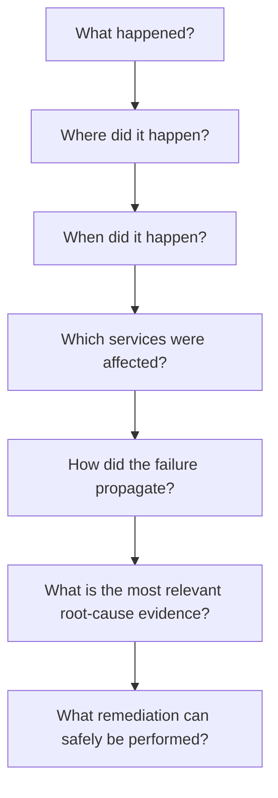
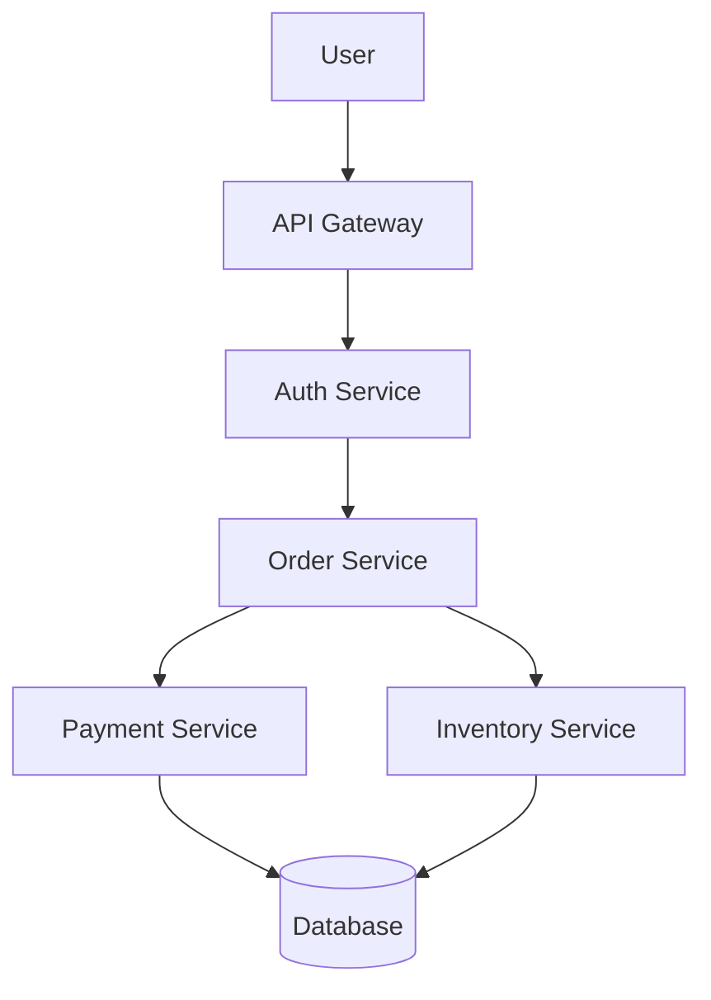
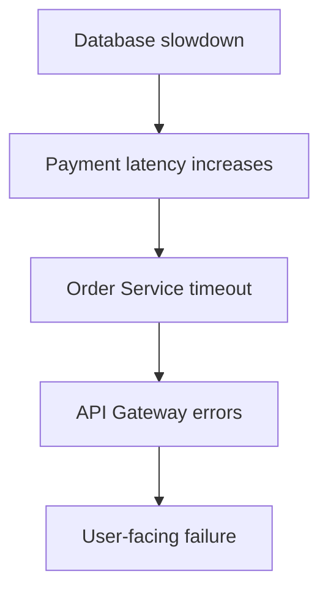
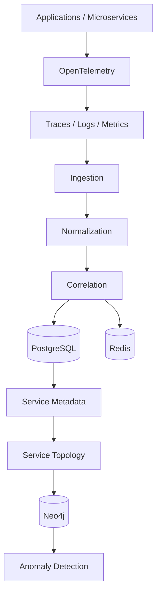
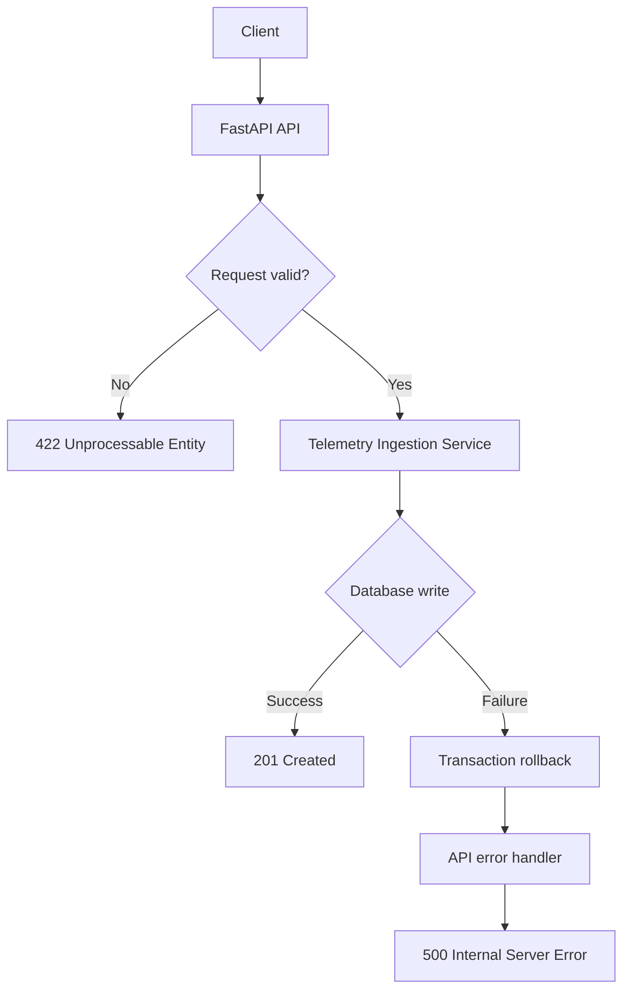

# TraceRCA AI

**Distributed OpenTelemetry Multi-Layer Causal Inference & Auto-Healing Engine**

TraceRCA AI is an observability and root-cause-analysis (RCA) platform for distributed, microservice-based systems. It connects traces, logs, metrics, and topology into a single evidence chain, so that the *actual* cause of a failure can be found, explained, and safely remediated.

---

## Table of Contents

- [Overview](#overview)
- [Key Capabilities](#key-capabilities)
- [Project Vision](#project-vision)
- [Architecture](#architecture)
- [Project Status](#project-status)
- [M5 — Telemetry Ingestion API](#m5--telemetry-ingestion-api)
- [Project Structure](#project-structure)
- [Getting Started](#getting-started)
- [Testing](#testing)

---

## Overview

Modern systems can contain dozens or hundreds of interconnected services. When something fails, the visible error is rarely the real cause. TraceRCA AI is built to answer the full chain of incident questions:



## Key Capabilities

| Area | Capability |
|---|---|
| **Telemetry** | OpenTelemetry traces, application logs, infrastructure metrics |
| **Context** | Service metadata, service dependency graphs, deployment and configuration changes |
| **Correlation** | Incident and alert correlation, temporal dependency analysis |
| **Intelligence** | Causal inference, Graph RAG, evidence-based root-cause analysis |
| **Impact** | Blast-radius analysis |
| **Action** | Remediation recommendations, controlled auto-healing |

---

## Project Vision

A single user request can travel through many components:



When a failure occurs, the visible symptom may sit far from the underlying cause. For example:



Traditional monitoring shows each of these signals separately. TraceRCA AI connects them and preserves the relationships required for deeper analysis.

### Core Problem

Distributed systems produce many kinds of operational data:

- Distributed traces
- Application logs
- Infrastructure metrics
- Service metadata and dependency relationships
- Alerts and incident information
- Deployment and configuration changes

The challenge is not collecting this data. It is **understanding** it: correlating signals across services and time to find the root cause and decide what can be fixed safely.

---

## Architecture

The project is delivered in three parts:

| Part | Name | Focus |
|---|---|---|
| **Part 1** | Observability Foundation | Ingest, normalize, and correlate telemetry; build service topology; detect anomalies |
| **Part 2** | AI Root Cause Intelligence | Causal inference, Graph RAG, evidence-based RCA, blast-radius analysis |
| **Part 3** | Auto-Healing & Production | Remediation recommendations, controlled auto-healing, production hardening |

### Part 1 — Observability Foundation

Part 1 produces reliable, structured information for the AI intelligence layer to consume.



**Expected output of Part 1:** Telemetry → Normalized Events → Correlated Events → Service Topology → Anomalies.

---

## Project Status

**Active development — Part 1 (Observability Foundation).**

| Part | Status |
|---|---|
| Part 1 — Observability Foundation | 🔄 In progress (currently on M5) |
| Part 2 — AI Root Cause Intelligence | ⏳ Planned |
| Part 3 — Auto-Healing & Production | ⏳ Planned |

---

## M5 — Telemetry Ingestion API

**Status:** 🔄 In progress

The Telemetry Ingestion API is the entry point for telemetry from OpenTelemetry-enabled services. It validates incoming data, converts it into the internal `TelemetryEvent` model, and persists it to PostgreSQL.

### Endpoints

| Method | Endpoint | Purpose |
|---|---|---|
| `POST` | `/telemetry/traces` | Ingest trace spans |
| `POST` | `/telemetry/logs` | Ingest application logs |
| `POST` | `/telemetry/metrics` | Ingest infrastructure metrics |

### Request Flow



### Milestone Progress

| Step | Description | Status |
|---|---|---|
| M5.1 | Inspect M4 and freeze telemetry contracts | ✅ Complete |
| M5.2 | Create Pydantic telemetry ingestion schemas | ✅ Complete |
| M5.3 | Implement telemetry ingestion service | ✅ Complete |
| M5.4 | Implement `POST /telemetry/traces` | ✅ Complete |
| M5.5 | Implement `POST /telemetry/logs` | ✅ Complete |
| M5.6 | Implement `POST /telemetry/metrics` | ✅ Complete |
| M5.7 | Connect ingestion service to PostgreSQL and add tests | ✅ Complete |
| M5.8 | Error handling and validation | ✅ Complete |
| M5.9 | Unit and API tests | ⏳ Pending |
| M5.10 | OpenTelemetry integration test | ⏳ Pending |

### M5.8 — Error Handling & Validation

M5.8 adds schema validation, service-level error handling, API-level exception handling, and consistent error responses across all three endpoints.

#### Schema Validation

Validation is enforced with Pydantic. Whitespace-only values are rejected for important string fields, maximum lengths are enforced on identifiers and messages, and flexible OpenTelemetry attributes are preserved.

| Signal | Rules |
|---|---|
| **Traces** | `trace_id`, `span_id`, `service_name`, `operation_name` must be non-empty; optional parent span ID has a maximum length; `duration_ms` must not be negative; `status` must be `UNSET`, `OK`, or `ERROR` |
| **Logs** | `service_name` and `message` must be non-empty; maximum message length; timestamp must be valid |
| **Metrics** | `service_name` and `metric_name` must be non-empty and valid; `metric_value` must be numeric; timestamp must be valid |

Invalid requests return `422 Unprocessable Entity`.

#### Database Error Handling

The ingestion service handles SQLAlchemy errors and operating-system/database connection errors. On failure it:

1. Rolls back the active transaction, so no partial writes are left behind.
2. Re-raises the original exception.
3. Lets the API layer translate it into a consistent client response, without exposing internal database details.

#### Error Response Contract

All three endpoints return the same structure on persistence failure:

```http
HTTP/1.1 500 Internal Server Error
```

```json
{
  "detail": "Failed to persist telemetry event"
}
```

| Scenario | Status Code |
|---|---|
| Event stored successfully | `201 Created` |
| Invalid request payload | `422 Unprocessable Entity` |
| Database / persistence failure | `500 Internal Server Error` |

#### M5.8 Checklist

- [x] M5.8.1 Inspect current validation and error behavior
- [x] M5.8.2 Strengthen Pydantic schema validation
- [x] M5.8.3 Add service-level database error handling
- [x] M5.8.4 Add API-level exception handling
- [x] M5.8.5 Test invalid trace requests
- [x] M5.8.6 Test invalid log requests
- [x] M5.8.7 Test invalid metric requests
- [x] M5.8.8 Test database failure handling
- [x] M5.8.9 Verify consistent API error responses
- [x] M5.8.10 Run final verification

#### Verification Result

```bash
pytest -q tests/test_ingestion_service.py tests/test_telemetry_api.py
```

**16 tests passed.** This confirmed that schema validation works for traces, logs, and metrics; that database errors are handled and rolled back at the service layer; that all endpoints return the same 500 response on persistence failure; and that existing ingestion functionality is unaffected.

---

## Project Structure

```text
TraceRCA-AI/
├── backend/
│   ├── __init__.py
│   ├── app/
│   │   ├── __init__.py
│   │   ├── main.py
│   │   ├── api/
│   │   │   └── routes/
│   │   │       └── health.py
│   │   ├── cache/
│   │   │   ├── dependencies.py
│   │   │   └── redis_client.py
│   │   ├── core/
│   │   │   └── config.py
│   │   ├── db/
│   │   │   ├── base.py
│   │   │   ├── database.py
│   │   │   └── models.py
│   │   └── telemetry/
│   │       ├── models.py
│   │       └── tracing.py
│   └── alembic/
│       ├── env.py
│       └── versions/
├── tests/
│   ├── test_health.py
│   ├── test_database_connection.py
│   ├── test_redis.py
│   ├── test_tracing.py
│   ├── test_telemetry_models.py
│   ├── test_ingestion_service.py
│   └── test_telemetry_api.py
├── docs/
├── scripts/
├── .env.example
├── .gitignore
├── alembic.ini
├── pyproject.toml
├── requirements.txt
└── README.md
```

---

## Getting Started

> **Prerequisites:** Python, PostgreSQL, and Redis.

```bash
# 1. Install dependencies
pip install -r requirements.txt

# 2. Configure environment variables
cp .env.example .env

# 3. Apply database migrations
alembic upgrade head

# 4. Run the API
uvicorn backend.app.main:app --reload
```

## Testing

```bash
# Run the full test suite
pytest -q

# Run the telemetry ingestion tests
pytest -q tests/test_ingestion_service.py tests/test_telemetry_api.py
```