# TraceRCA AI

**Distributed OpenTelemetry Multi-Layer Causal Inference & Auto-Healing Engine**

TraceRCA AI is an observability and root-cause-analysis (RCA) platform for distributed, microservice-based systems. It connects traces, logs, metrics, and topology into a single evidence chain, so that the *actual* cause of a failure can be found, explained, and safely remediated.

---

## Table of Contents

- [Overview](#overview)
- [Key Capabilities](#key-capabilities)
- [Project Vision](#project-vision)
- [Architecture](#architecture)
- [Project Status](#project-status)
- [Telemetry Ingestion API](#telemetry-ingestion-api)
- [OpenTelemetry Integration](#opentelemetry-integration)
- [Database Schema Evolution](#database-schema-evolution)
- [Telemetry Normalization](#telemetry-normalization)
  - [Why Normalization Matters](#why-normalization-matters)
  - [Normalized Telemetry Schema](#normalized-telemetry-schema)
  - [Trace Normalization](#trace-normalization)
  - [Log Normalization](#log-normalization)
  - [Metric Normalization](#metric-normalization)
  - [Normalization Service / Pipeline](#normalization-service--pipeline)
  - [Normalization Roadmap](#normalization-roadmap)
- [Telemetry Correlation](#telemetry-correlation)
  - [Why Correlation Matters](#why-correlation-matters)
  - [Correlation Contract & Identifiers](#correlation-contract--identifiers)
  - [Correlation Rules](#correlation-rules)
  - [Trace–Log Correlation](#tracelog-correlation)
  - [Trace–Metric Correlation](#tracemetric-correlation)
  - [Time / Service-Based Correlation](#time--service-based-correlation)
  - [Unified Correlation Service / Pipeline](#unified-correlation-service--pipeline)
  - [Correlation Roadmap](#correlation-roadmap)
- [Service Topology + Neo4j](#service-topology--neo4j)
  - [Why Service Topology Matters](#why-service-topology-matters)
  - [Topology Architecture](#topology-architecture)
  - [Topology Contract](#topology-contract)
  - [Topology Construction Rules](#topology-construction-rules)
  - [Topology Schemas](#topology-schemas)
  - [Neo4j Infrastructure](#neo4j-infrastructure)
  - [Neo4j Connection Layer](#neo4j-connection-layer)
  - [Service-Node Creation / Upsert](#service-node-creation--upsert)
  - [Dependency-Edge Creation / Upsert](#dependency-edge-creation--upsert)
  - [Topology Construction Pipeline](#topology-construction-pipeline)
  - [Topology Query / Retrieval](#topology-query--retrieval)
  - [Dashboard Integration Direction](#dashboard-integration-direction)
  - [Topology Testing & Verification](#topology-testing--verification)
  - [Topology Roadmap](#topology-roadmap)
- [Project Structure](#project-structure)
- [Getting Started](#getting-started)
- [Testing](#testing)

---

## Overview

Modern systems can contain dozens or hundreds of interconnected services. When something fails, the visible error is rarely the real cause. TraceRCA AI is built to answer the full chain of incident questions:

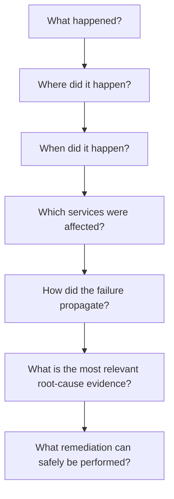
```mermaid
flowchart TD
    A[What happened?] --> B[Where did it happen?]
    B --> C[When did it happen?]
    C --> D[Which services were affected?]
    D --> E[How did the failure propagate?]
    E --> F[What is the most relevant root-cause evidence?]
    F --> G[What remediation can safely be performed?]
```

## Key Capabilities

| Area | Capability |
|---|---|
| **Telemetry** | OpenTelemetry traces, application logs, infrastructure metrics |
| **Context** | Service metadata, service dependency graphs, deployment and configuration changes |
| **Correlation** | Incident and alert correlation, temporal dependency analysis |
| **Intelligence** | Causal inference, Graph RAG, evidence-based root-cause analysis |
| **Impact** | Blast-radius analysis |
| **Action** | Remediation recommendations, controlled auto-healing |

---

## Project Vision

A single user request can travel through many components:

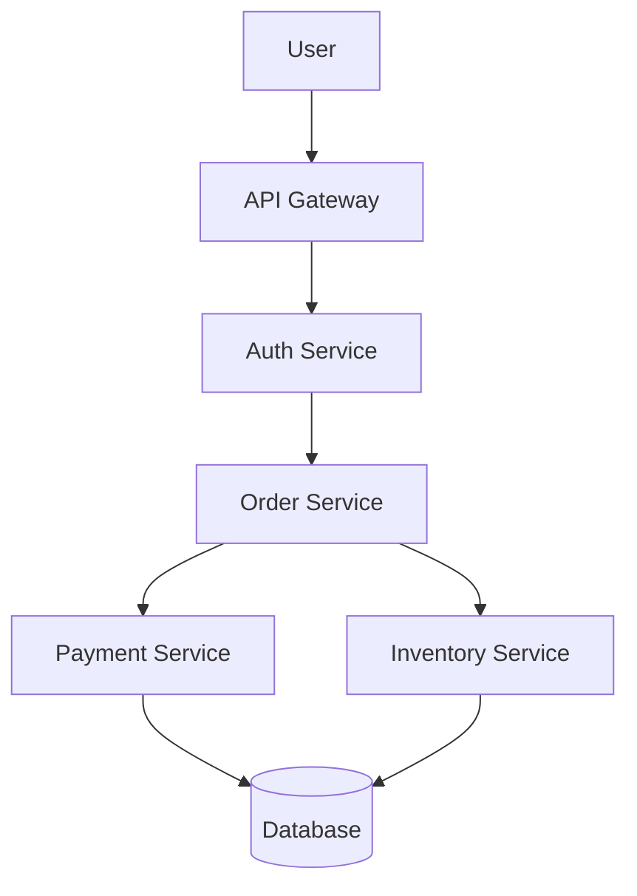
```mermaid
flowchart TD
    U[User] --> G[API Gateway]
    G --> A[Auth Service]
    A --> O[Order Service]
    O --> P[Payment Service]
    O --> I[Inventory Service]
    P --> D[(Database)]
    I --> D
```

When a failure occurs, the visible symptom may sit far from the underlying cause. For example:

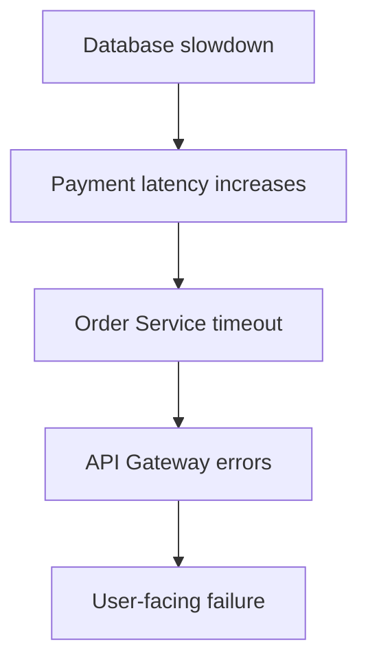
```mermaid
flowchart TD
    A[Database slowdown] --> B[Payment latency increases]
    B --> C[Order Service timeout]
    C --> D[API Gateway errors]
    D --> E[User-facing failure]
```

Traditional monitoring shows each of these signals separately. TraceRCA AI connects them and preserves the relationships required for deeper analysis.

### Core Problem

Distributed systems produce many kinds of operational data:

- Distributed traces
- Application logs
- Infrastructure metrics
- Service metadata and dependency relationships
- Alerts and incident information
- Deployment and configuration changes

The challenge is not collecting this data. It is **understanding** it: correlating signals across services and time to find the root cause and decide what can be fixed safely.

---

## Architecture

The project is delivered in three parts:

| Part | Name | Focus |
|---|---|---|
| **Part 1** | Observability Foundation | Ingest, normalize, and correlate telemetry; build service topology; detect anomalies |
| **Part 2** | AI Root Cause Intelligence | Causal inference, Graph RAG, evidence-based RCA, blast-radius analysis |
| **Part 3** | Auto-Healing & Production | Remediation recommendations, controlled auto-healing, production hardening |

### Part 1 — Observability Foundation

Part 1 produces reliable, structured information for the AI intelligence layer to consume.

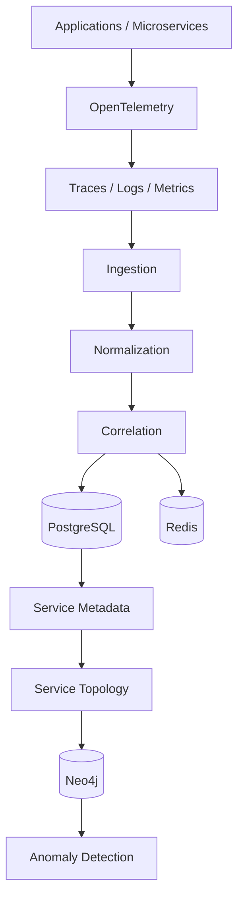
```mermaid
flowchart TD
    S[Applications / Microservices] --> OT[OpenTelemetry]
    OT --> T[Traces / Logs / Metrics]
    T --> ING[Ingestion]
    ING --> NORM[Normalization]
    NORM --> CORR[Correlation]
    CORR --> PG[(PostgreSQL)]
    CORR --> RD[(Redis)]
    PG --> META[Service Metadata]
    META --> TOPO[Service Topology]
    TOPO --> N4J[(Neo4j)]
    N4J --> ANOM[Anomaly Detection]
```

**Expected output of Part 1:** Telemetry → Normalized Events → Correlated Events → Service Topology → Anomalies.

---

## Project Status

**Active development — Part 1 (Observability Foundation).**

| Part | Status |
|---|---|
| Part 1 — Observability Foundation | 🔄 In progress — ingestion, normalization, correlation, and service topology complete |
| Part 2 — AI Root Cause Intelligence | ⏳ Planned |
| Part 3 — Auto-Healing & Production | ⏳ Planned |

### Part 1 Workstreams

| Workstream | Status |
|---|---|
| Telemetry Ingestion API | ✅ Complete |
| OpenTelemetry Integration | ✅ Complete |
| Database Schema Evolution (trace fields) | ✅ Complete |
| Telemetry Normalization | ✅ Complete |
| Telemetry Correlation | ✅ Complete |
| Service Topology + Neo4j | ✅ Complete |

---

## Telemetry Ingestion API

The Telemetry Ingestion API is the entry point for telemetry from OpenTelemetry-enabled services. It validates incoming data, converts it into the internal `TelemetryEvent` model, and persists it to PostgreSQL.

**Status:** ✅ Complete

### Endpoints

| Method | Endpoint | Purpose |
|---|---|---|
| `POST` | `/telemetry/traces` | Ingest trace spans |
| `POST` | `/telemetry/logs` | Ingest application logs |
| `POST` | `/telemetry/metrics` | Ingest infrastructure metrics |

### Request Flow

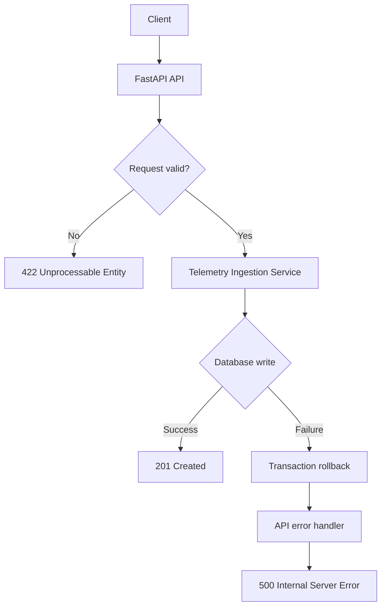
```mermaid
flowchart TD
    C[Client] --> API[FastAPI API]
    API --> V{Request valid?}
    V -- No --> E422[422 Unprocessable Entity]
    V -- Yes --> SVC[Telemetry Ingestion Service]
    SVC --> DB{Database write}
    DB -- Success --> OK[201 Created]
    DB -- Failure --> RB[Transaction rollback]
    RB --> H[API error handler]
    H --> E500[500 Internal Server Error]
```

### Build Checklist

- [x] Freeze telemetry contracts
- [x] Create Pydantic telemetry ingestion schemas
- [x] Implement telemetry ingestion service
- [x] Implement `POST /telemetry/traces`
- [x] Implement `POST /telemetry/logs`
- [x] Implement `POST /telemetry/metrics`
- [x] Connect ingestion service to PostgreSQL
- [x] Error handling and validation
- [x] Unit and API tests
- [x] OpenTelemetry integration test

### Validation Rules

Validation is enforced with Pydantic. Whitespace-only values are rejected for important string fields, maximum lengths are enforced on identifiers and messages, and flexible OpenTelemetry attributes are preserved.

| Signal | Rules |
|---|---|
| **Traces** | `trace_id`, `span_id`, `service_name`, `operation_name` must be non-empty; optional parent span ID has a maximum length; `duration_ms` must not be negative; `status` must be `UNSET`, `OK`, or `ERROR` |
| **Logs** | `service_name` and `message` must be non-empty; maximum message length; timestamp must be valid |
| **Metrics** | `service_name` and `metric_name` must be non-empty and valid; `metric_value` must be numeric; timestamp must be valid |

Invalid requests return `422 Unprocessable Entity`.

### Error Handling

The ingestion service handles SQLAlchemy errors and operating-system/database connection errors. On failure it:

1. Rolls back the active transaction, so no partial writes are left behind.
2. Re-raises the original exception.
3. Lets the API layer translate it into a consistent client response, without exposing internal database details.

All three endpoints return the same structure on persistence failure:

```http
HTTP/1.1 500 Internal Server Error
```

```json
{
  "detail": "Failed to persist telemetry event"
}
```

| Scenario | Status Code |
|---|---|
| Event stored successfully | `201 Created` |
| Invalid request payload | `422 Unprocessable Entity` |
| Database / persistence failure | `500 Internal Server Error` |

### Testing & Verification

Coverage includes trace, log, and metric persistence; successful and invalid API requests for all three telemetry types; and database failure / transaction rollback handling. API success-path tests isolate the HTTP contract from real persistence, while the ingestion service tests verify actual PostgreSQL writes.

```bash
pytest -q tests/test_ingestion_service.py tests/test_telemetry_api.py
```

**16 tests passed** — schema validation works for traces, logs, and metrics; database errors are handled and rolled back at the service layer; all endpoints return a consistent `500` on persistence failure; existing ingestion functionality is unaffected.

---

## OpenTelemetry Integration

**Status:** ✅ Complete

This verifies the complete telemetry flow from an OpenTelemetry span through to PostgreSQL, using the real ingestion service and a real database rather than mocking persistence.

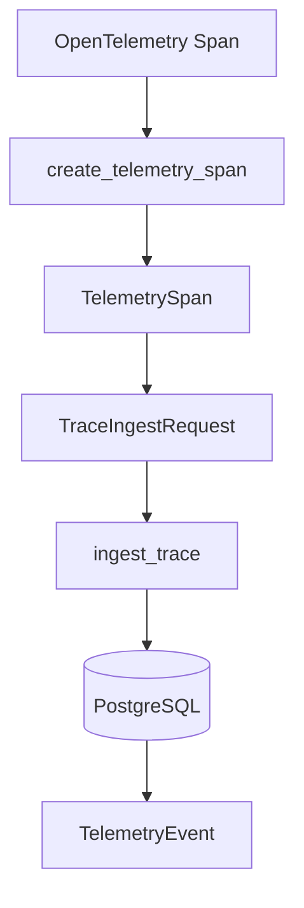
```mermaid
flowchart TD
    SP[OpenTelemetry Span] --> CTS[create_telemetry_span]
    CTS --> TS[TelemetrySpan]
    TS --> TIR[TraceIngestRequest]
    TIR --> IT[ingest_trace]
    IT --> PG[(PostgreSQL)]
    PG --> EV[TelemetryEvent]
```

This confirms that the OpenTelemetry foundation feeds correctly into the telemetry ingestion pipeline.

### Verification

| Test run | Result |
|---|---|
| Full project test suite | 28 passed |
| OpenTelemetry integration test (standalone) | 1 passed |
| Existing OpenTelemetry tests + integration test | 3 passed |

### Output

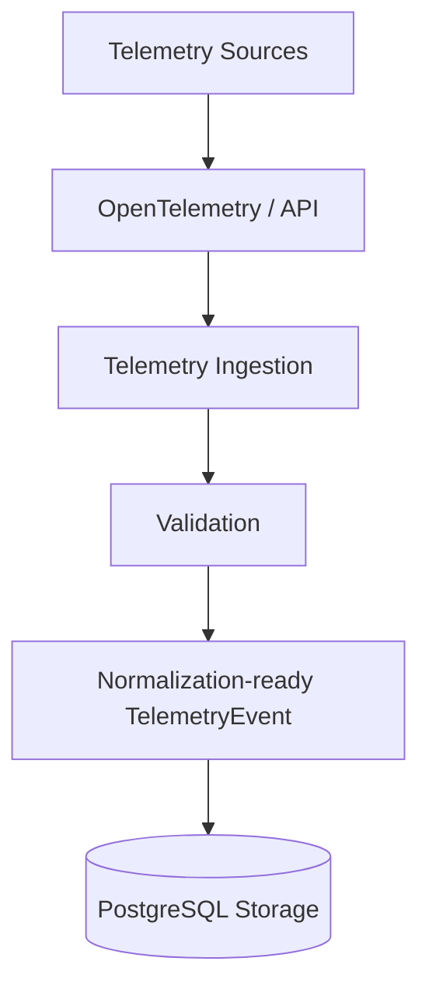
```mermaid
flowchart TD
    TS[Telemetry Sources] --> OT[OpenTelemetry / API]
    OT --> ING[Telemetry Ingestion]
    ING --> VAL[Validation]
    VAL --> EV[Normalization-ready TelemetryEvent]
    EV --> PG[(PostgreSQL Storage)]
```

This output is the input boundary for telemetry normalization:

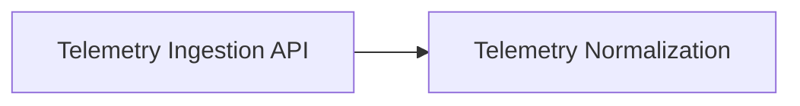
```mermaid
flowchart LR
    ING[Telemetry Ingestion API] --> NORM[Telemetry Normalization]
```

---

## Database Schema Evolution

**Status:** ✅ Complete

Inspected the telemetry data produced by ingestion and compared the ingestion schemas, SQLAlchemy models, and the actual PostgreSQL table structure.

### Findings

The `telemetry_events` table already stored:

`event_type`, `timestamp`, `service_name`, `trace_id`, `span_id`, `parent_span_id`, `message`, `metric_name`, `metric_value`, `attributes`, `created_at`

However, the trace ingestion schema already accepted three fields that were **not** being persisted:

- `operation_name`
- `duration_ms`
- `status`

These matter for the RCA pipeline because:

| Field | Why it matters |
|---|---|
| `operation_name` | Identifies the failing or slow operation |
| `duration_ms` | Enables latency and performance analysis |
| `status` | Enables error/failure detection |

### Schema Update

The `TelemetryEvent` SQLAlchemy model was updated with:

```text
operation_name  VARCHAR(255)
duration_ms     FLOAT
status          VARCHAR(50)
```

### Migration

An Alembic migration was generated and applied:

```text
ce12331ef2cd → c0ebede2393f_add_trace_fields_to_telemetry_events.py
```

PostgreSQL verification confirmed the three new columns are present on `telemetry_events`. Existing log and metric records correctly show the new fields as `None` for historical rows created before the schema update.

### Trace Ingestion Update

The trace ingestion service was updated to persist `operation_name`, `duration_ms`, and `status` on new trace events.

```bash
pytest -q tests/test_ingestion_service.py tests/test_telemetry_integration.py
```

**7 tests passed** — the updated trace ingestion service correctly persists `operation_name`, `duration_ms`, and `status`; existing log and metric ingestion is unaffected; an OpenTelemetry trace flows end to end through the ingestion pipeline into PostgreSQL.

---

## Telemetry Normalization

**Status:** ✅ Complete

### Why Normalization Matters

Telemetry arrives in three different shapes:

```text
Trace:  service_name, operation_name, duration_ms, status, trace_id
Log:    service_name, message, trace_id
Metric: service_name, metric_name, metric_value
```

If these are sent directly to the RCA engine, it has to understand three different formats. Normalization converts all three into one common structure before anything downstream sees them:

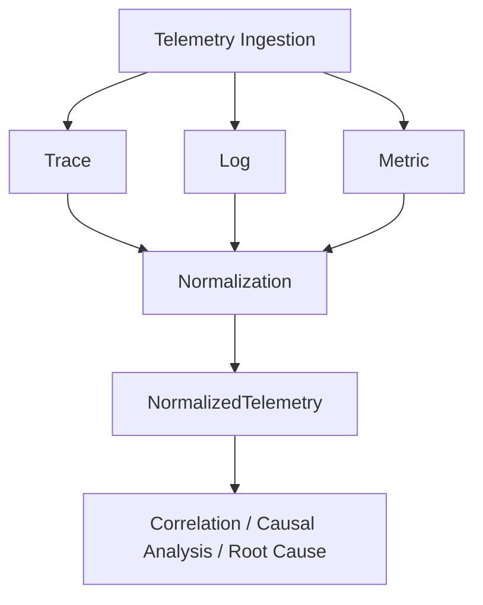
```mermaid
flowchart TD
    ING[Telemetry Ingestion] --> T[Trace]
    ING --> L[Log]
    ING --> M[Metric]
    T --> N[Normalization]
    L --> N
    M --> N
    N --> NT[NormalizedTelemetry]
    NT --> RCA[Correlation / Causal Analysis / Root Cause]
```

This is what lets the RCA engine ask cross-signal questions such as *"did the CPU spike happen before the request became slow?"* or *"did the database error occur during the failed trace?"* — questions that require traces, logs, and metrics to already speak the same language.

> **Normalization** = converting different telemetry formats into one common language so the rest of TraceRCA can analyze traces, logs, and metrics together.

Raw ingestion schemas are not replaced — they are kept as the input boundary, and normalization sits as a layer after them:

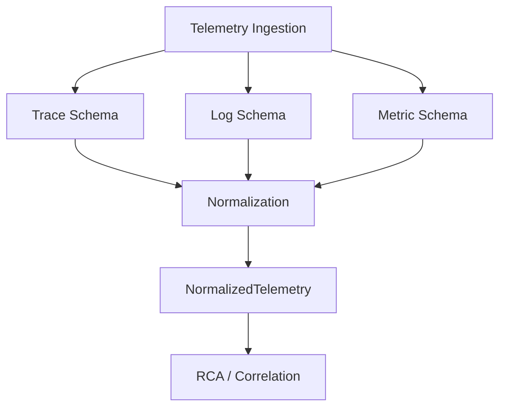
```mermaid
flowchart TD
    ING[Telemetry Ingestion] --> TS[Trace Schema]
    ING --> LS[Log Schema]
    ING --> MS[Metric Schema]
    TS --> NORM[Normalization]
    LS --> NORM
    MS --> NORM
    NORM --> NT[NormalizedTelemetry]
    NT --> RCA[RCA / Correlation]
```

### Normalized Telemetry Schema

Rather than three separate normalized schemas (one each for traces, logs, metrics), a single common schema was designed:

```text
                 NormalizedTelemetry
                /         |          \
            Trace        Log        Metric
```

| Field | Type | Required | Used by |
|---|---|---|---|
| `event_id` | UUID | ✅ | all |
| `event_type` | `trace` / `log` / `metric` | ✅ | all |
| `timestamp` | datetime | ✅ | all |
| `service_name` | string | ✅ | all |
| `operation_name` | string \| None | — | trace |
| `trace_id` | string \| None | — | trace, log |
| `span_id` | string \| None | — | trace, log |
| `parent_span_id` | string \| None | — | trace |
| `duration_ms` | float \| None | — | trace |
| `status` | `UNSET`/`OK`/`ERROR` \| None | — | trace |
| `message` | string \| None | — | log |
| `metric_name` | string \| None | — | metric |
| `metric_value` | float \| None | — | metric |
| `attributes` | `dict[str, Any]` | ✅ | all |

**Validation rules:**

- `event_type` must be `trace`, `log`, or `metric`
- `service_name` is required and cannot be empty or whitespace-only
- `duration_ms` cannot be negative
- `status` must be `UNSET`, `OK`, or `ERROR`
- `message` cannot be empty if provided
- `metric_name` has string length limits
- Identifier fields are optional strings with length limits
- `attributes` must be a dictionary

```bash
pytest -q
```

**9 tests passed**, confirming:

- Valid `NormalizedTelemetry` objects are accepted
- Invalid `event_type` is rejected
- Negative `duration_ms` is rejected
- Empty `service_name` is rejected
- Invalid `status` is rejected
- Empty `message` is rejected
- Trace, log, and metric telemetry all fit the common schema

### Trace Normalization

**Status:** ✅ Complete

| Source field (`TelemetryEvent`) | Normalized field |
|---|---|
| `id` | `event_id` |
| `event_type` | `event_type` |
| `timestamp` | `timestamp` |
| `service_name` | `service_name` |
| `operation_name` | `operation_name` |
| `trace_id` | `trace_id` |
| `span_id` | `span_id` |
| `parent_span_id` | `parent_span_id` |
| `duration_ms` | `duration_ms` |
| `status` | `status` |
| `attributes` | `attributes` |

`message`, `metric_name`, and `metric_value` remain `None` for trace events.

```python
NormalizedTelemetry(
    event_type="trace",
    service_name="payment-service",
    operation_name="process-payment",
    duration_ms=245.5,
    status="ERROR",
    trace_id="abc123",
    span_id="span456",
)
```

A guard prevents other event types from reaching the trace normalizer:

```python
if event.event_type != "trace":
    raise ValueError("Expected a trace telemetry event")
```

```bash
pytest -q tests/test_trace_normalizer.py tests/test_normalized_telemetry.py
```

**13 tests passed** — trace telemetry is correctly transformed from the persisted `TelemetryEvent` into `NormalizedTelemetry`; all trace fields are preserved; non-trace events are rejected by the trace normalizer; missing optional fields and attributes are handled safely.

### Log Normalization

**Status:** ✅ Complete

| Source field (`TelemetryEvent`) | Normalized field |
|---|---|
| `id` | `event_id` |
| `event_type` | `event_type` |
| `timestamp` | `timestamp` |
| `service_name` | `service_name` |
| `trace_id` | `trace_id` |
| `span_id` | `span_id` |
| `message` | `message` |
| `attributes` | `attributes` |

`operation_name`, `parent_span_id`, `duration_ms`, `status`, `metric_name`, and `metric_value` remain `None` for log events.

```python
NormalizedTelemetry(
    event_type="log",
    service_name="payment-service",
    message="Database connection failed",
    trace_id="abc123",
    span_id="span456",
    attributes={"level": "ERROR"},
)
```

Edge cases tested: a log without `trace_id`, a log without `span_id`, and a log with `attributes=None` (which normalizes to `{}`).

```bash
pytest -q tests/test_log_normalizer.py
```

**2 tests passed** — log telemetry normalizes correctly, with optional fields and missing attributes handled safely.

### Metric Normalization

**Status:** ✅ Complete

Converts persisted `TelemetryEvent` metric records into the common `NormalizedTelemetry` representation.

| Source field (`TelemetryEvent`) | Normalized field |
|---|---|
| `id` | `event_id` |
| `event_type` | `event_type` |
| `timestamp` | `timestamp` |
| `service_name` | `service_name` |
| `metric_name` | `metric_name` |
| `metric_value` | `metric_value` |
| `attributes` | `attributes` |

`operation_name`, `trace_id`, `span_id`, `parent_span_id`, `duration_ms`, `status`, and `message` remain `None` for metric events.

```python
NormalizedTelemetry(
    event_type="metric",
    service_name="payment-service",
    metric_name="cpu_usage",
    metric_value=95.4,
    attributes={...},
)
```

A guard prevents other event types from reaching the metric normalizer, and attributes are handled safely when missing:

```python
if event.event_type != "metric":
    raise ValueError("Expected a metric telemetry event")
```

Zero and negative metric values are preserved correctly rather than being treated as missing data.

```bash
pytest -q tests/test_metric_normalizer.py
```

**5 tests passed.**

Combined verification across all three normalizers:

```bash
pytest -q tests/test_trace_normalizer.py tests/test_log_normalizer.py tests/test_metric_normalizer.py
```

**14 tests passed** — trace, log, and metric telemetry can all be transformed correctly into the common `NormalizedTelemetry` structure, and the metric normalizer handles optional attributes and valid metric values safely.

### Normalization Service / Pipeline

**Status:** ✅ Complete

With all three event-specific normalizers in place, a single routing layer was added so the rest of the system doesn't need to know which normalizer to call for a given event:

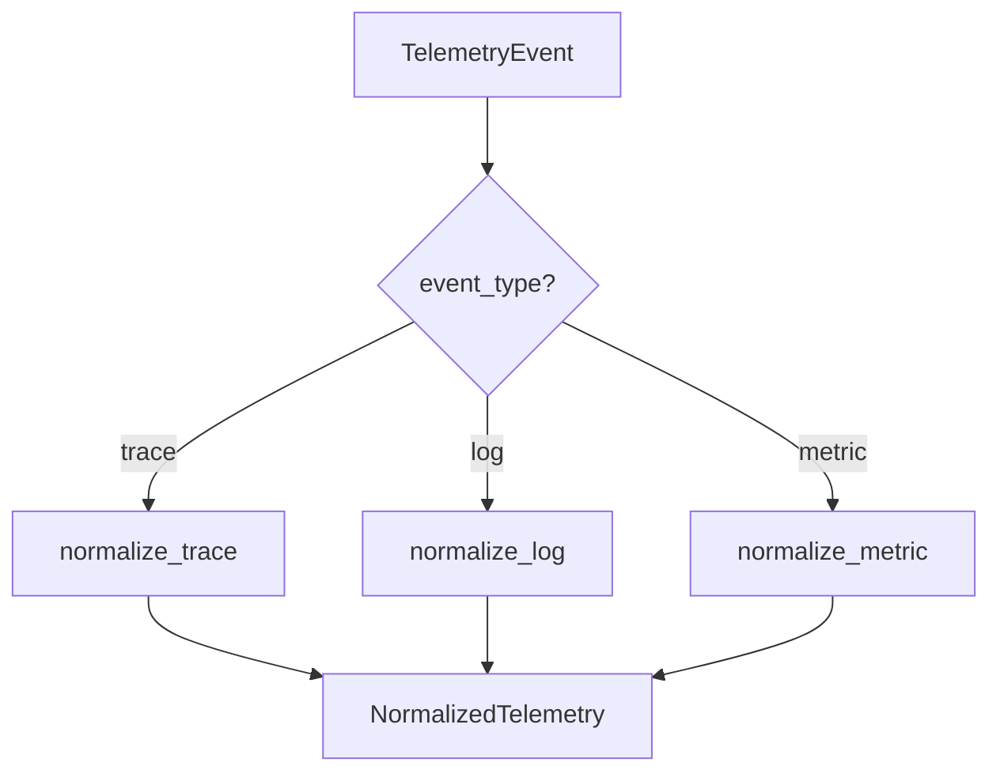
```mermaid
flowchart TD
    E[TelemetryEvent] --> R{event_type?}
    R -- trace --> NT1[normalize_trace]
    R -- log --> NT2[normalize_log]
    R -- metric --> NT3[normalize_metric]
    NT1 --> OUT[NormalizedTelemetry]
    NT2 --> OUT
    NT3 --> OUT
```

The service is intentionally a thin router — it contains no normalization logic of its own, only the decision of which normalizer to call — which keeps the architecture modular and makes it straightforward to add another telemetry type later.

```python
def normalize_event(event: TelemetryEvent) -> NormalizedTelemetry:
    """
    Normalize a telemetry event using the appropriate
    event-specific normalizer.
    """
    if event.event_type == "trace":
        return normalize_trace(event)
    if event.event_type == "log":
        return normalize_log(event)
    if event.event_type == "metric":
        return normalize_metric(event)
    raise ValueError(
        f"Unsupported telemetry event type: {event.event_type}"
    )
```

Callers now go through a single entry point, `normalize_event(event)`, rather than knowing about `normalize_trace`, `normalize_log`, and `normalize_metric` individually. Unsupported event types raise a clear error rather than failing silently.

```bash
pytest -q tests/test_trace_normalizer.py tests/test_log_normalizer.py tests/test_metric_normalizer.py tests/test_normalization_service.py tests/test_normalized_telemetry.py
```

**27 tests passed** — this confirmed that the normalized telemetry schema, trace normalization, log normalization, metric normalization, and the unified normalization service all work correctly together. This is the full normalization foundation, verified end to end:

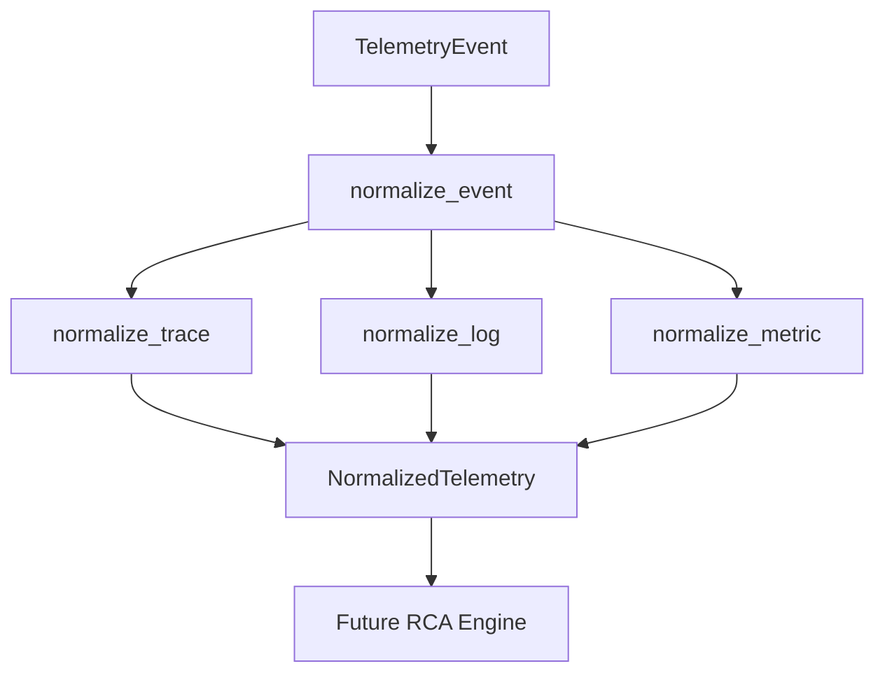
```mermaid
flowchart TD
    E[TelemetryEvent] --> NE[normalize_event]
    NE --> T[normalize_trace]
    NE --> L[normalize_log]
    NE --> M[normalize_metric]
    T --> NT[NormalizedTelemetry]
    L --> NT
    M --> NT
    NT --> RCA[Future RCA Engine]
```

### Normalization Roadmap

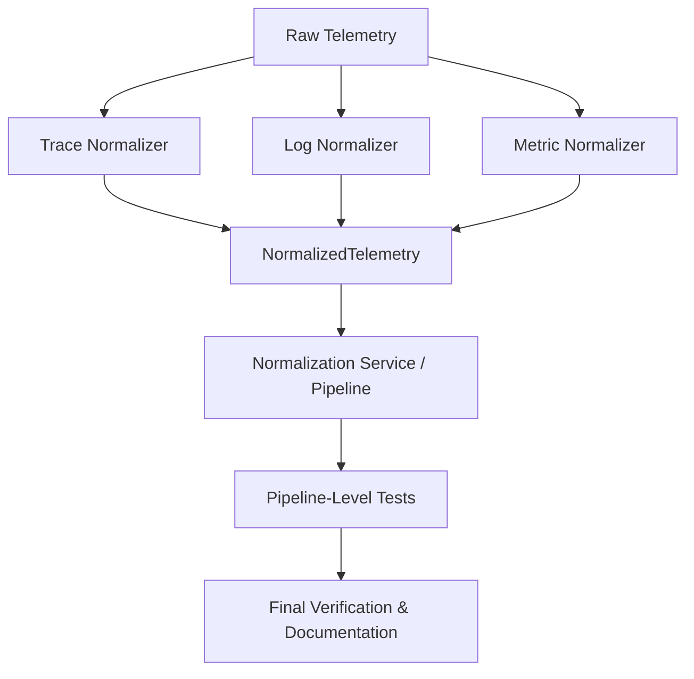
```mermaid
flowchart TD
    RAW[Raw Telemetry] --> T[Trace Normalizer]
    RAW --> L[Log Normalizer]
    RAW --> M[Metric Normalizer]
    T --> NT[NormalizedTelemetry]
    L --> NT
    M --> NT
    NT --> SVC[Normalization Service / Pipeline]
    SVC --> TEST[Pipeline-Level Tests]
    TEST --> DONE[Final Verification & Documentation]
```

| Task | Status |
|---|---|
| Freeze normalization contract | ✅ Complete |
| Define normalized telemetry schema | ✅ Complete |
| Trace normalization | ✅ Complete |
| Log normalization | ✅ Complete |
| Metric normalization | ✅ Complete |
| Normalization service / pipeline | ✅ Complete |
| Pipeline-level normalization tests | ✅ Complete |
| Final verification & documentation closeout | ✅ Complete |

### Final Verification

```text
30 passed
```

The complete normalization test suite — common schema validation, trace normalization, log normalization, metric normalization, and the unified `normalize_event()` pipeline — passes together. Telemetry Normalization is fully complete:

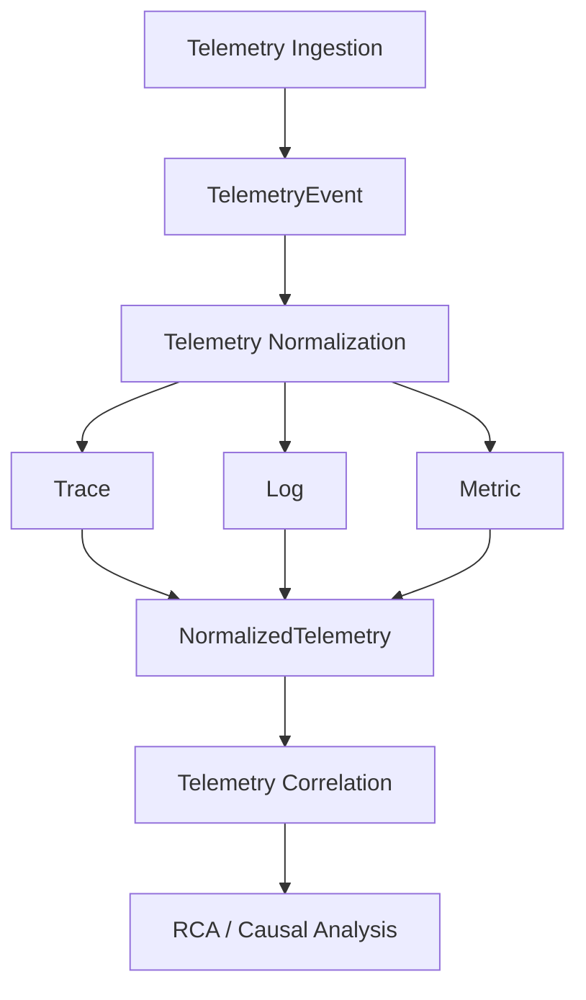
```mermaid
flowchart TD
    ING[Telemetry Ingestion] --> EV[TelemetryEvent]
    EV --> NORM[Telemetry Normalization]
    NORM --> T[Trace]
    NORM --> L[Log]
    NORM --> M[Metric]
    T --> NT[NormalizedTelemetry]
    L --> NT
    M --> NT
    NT --> CORR[Telemetry Correlation]
    CORR --> RCA[RCA / Causal Analysis]
```

---

## Telemetry Correlation

**Status:** ✅ Complete

### Why Correlation Matters

A single incident can surface as several unrelated-looking telemetry events:

```text
10:00:01  Trace  → payment-service → process-payment → ERROR
10:00:01  Log    → payment-service → "Database timeout"
10:00:02  Metric → payment-service → CPU = 95%
```

These are three separate events, but they likely belong to the same incident. Normalization tells us what each event looks like; correlation tells us which events belong together.

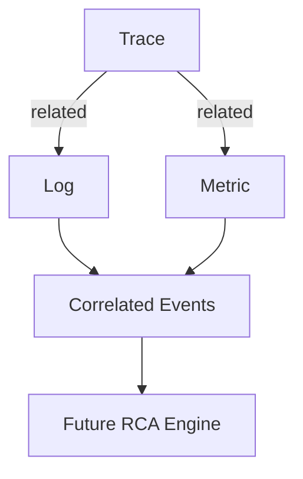
```mermaid
flowchart TD
    T[Trace] -- related --> L[Log]
    T -- related --> M[Metric]
    L --> OUT[Correlated Events]
    M --> OUT
    OUT --> RCA[Future RCA Engine]
```

### Correlation Contract & Identifiers

Correlation is built on top of `NormalizedTelemetry`, using four of its fields as correlation identifiers:

| Identifier | Strength | Purpose |
|---|---|---|
| `trace_id` | 🟢 Strong | Same distributed request |
| `span_id` | 🟢 Strong | Same operation / span |
| `service_name` | 🟡 Medium | Same microservice |
| `timestamp` | 🟡 Medium | Events happened near each other |

`event_id` is used only to uniquely identify an event — it never establishes correlation on its own.

### Correlation Rules

Each pair of events is scored against a fixed set of rules rather than treated as a simple match/no-match:

| Match | Strength |
|---|---|
| Same `trace_id` + same `span_id` | `VERY_STRONG` |
| Same `trace_id` | `STRONG` |
| Same `service_name` + within 5 seconds | `MEDIUM` |
| No matching rule | No correlation |

Giving correlations a strength — rather than a boolean — matters because later causal analysis can weight stronger relationships more heavily than weaker ones.

Every match produces a `CorrelationResult` describing the relationship rather than modifying either event:

```text
Event A ──────── correlation ──────── Event B
                     │
                     ├─ type
                     ├─ strength
                     └─ reason
```

### Trace–Log Correlation

The first and strongest practical rule: a trace and a log are correlated when they share the same `trace_id`.

```text
Trace:  trace_id = abc123, service = payment-service, operation = process-payment, status = ERROR
Log:    trace_id = abc123, service = payment-service, message = "Database connection timeout"
```

These two events are correlated because they belong to the same trace. Test coverage includes: matching `trace_id` → `STRONG`; differing `trace_id` → no correlation; missing `trace_id` → no trace-ID correlation.

### Trace–Metric Correlation

A metric doesn't carry a `trace_id`, so trace–metric correlation instead uses the service + time rule:

```text
trace.service_name == metric.service_name
AND
|trace.timestamp - metric.timestamp| <= 5 seconds
```

```text
Trace:   service = payment-service, time = 10:00:01
Metric:  service = payment-service, time = 10:00:04, CPU = 95%
```

A 3-second gap on the same service → `MEDIUM` correlation. Events on different services, or more than 5 seconds apart, are not correlated by this rule. No schema changes were needed — `service_name`, `timestamp`, and `event_id` on `NormalizedTelemetry` are sufficient.

### Time / Service-Based Correlation

The service + time rule was generalized into a single reusable function rather than being specific to trace–metric pairs:

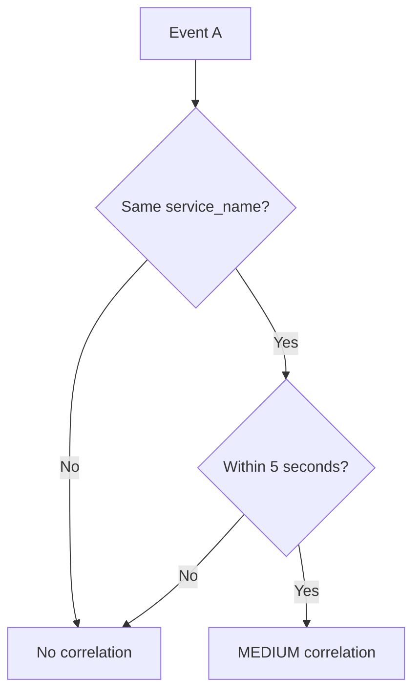
```mermaid
flowchart TD
    A[Event A] --> C{Same service_name?}
    C -- No --> N[No correlation]
    C -- Yes --> D{"Within 5 seconds?"}
    D -- No --> N
    D -- Yes --> R["MEDIUM correlation"]
```

This single function now covers trace↔log, trace↔metric, log↔metric, and metric↔metric pairs — anywhere two events share a service and occur within 5 seconds of each other.

### Unified Correlation Service / Pipeline

With trace–log, trace–metric, and generic service/time correlation implemented separately, a single entry point was added on top of them:

```python
def correlate_events(
    events: list[NormalizedTelemetry],
) -> list[CorrelationResult]:
    ...
```

It takes a list of normalized telemetry events and returns every valid correlation among them, applying the rules in order of strength:

| Situation | Rule | Strength |
|---|---|---|
| Trace + Log, same `trace_id` | Trace-ID match | `STRONG` |
| Trace + Metric | Same service + ≤ 5 sec | `MEDIUM` |
| Any compatible events | Same service + ≤ 5 sec | `MEDIUM` |

The service never modifies the telemetry events it's given — it only produces relationships between them:

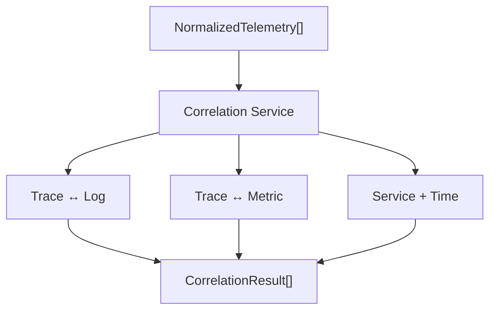
```mermaid
flowchart TD
    IN["NormalizedTelemetry[]"] --> SVC[Correlation Service]
    SVC --> TL["Trace ↔ Log"]
    SVC --> TM["Trace ↔ Metric"]
    SVC --> ST["Service + Time"]
    TL --> OUT["CorrelationResult[]"]
    TM --> OUT
    ST --> OUT
```

### Correlation Roadmap

| Task | Status |
|---|---|
| Inspect normalized telemetry and freeze correlation contract | ✅ Complete |
| Define correlation identifiers and matching rules | ✅ Complete |
| Trace–log correlation | ✅ Complete |
| Trace–metric correlation | ✅ Complete |
| Time / service-based correlation | ✅ Complete |
| Unified correlation service / pipeline | ✅ Complete |
| Correlation tests, final verification & documentation closeout | ✅ Complete |

### Final Verification

```text
23 passed
```

This confirmed trace–log correlation via `trace_id` (and the stronger `trace_id` + `span_id` match), trace–metric correlation via service and time proximity, the generic service/time rule, and the unified correlation service all work correctly together.

---

## Service Topology + Neo4j

**Status:** ✅ Complete

Transforms relationships observed in normalized telemetry into a persistent service dependency graph in Neo4j. The topology layer provides the structural context required by later RCA, Graph RAG, blast-radius analysis, and dashboard visualization.

### Why Service Topology Matters

Distributed systems contain multiple services that communicate with each other:

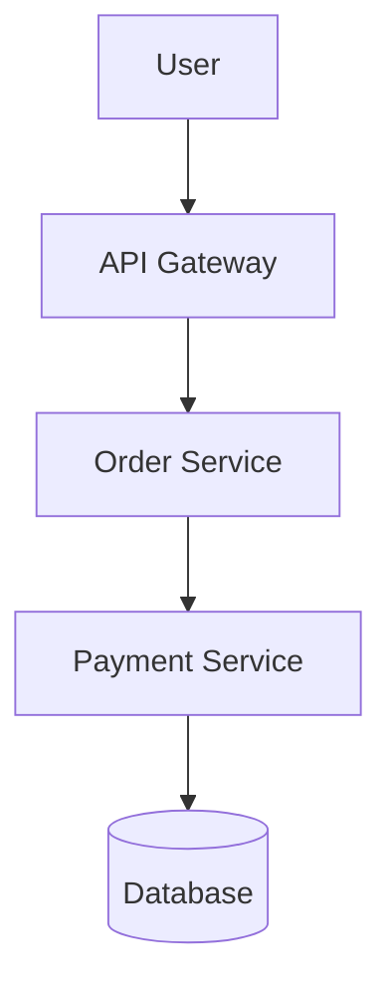
```mermaid
flowchart TD
    U[User] --> G[API Gateway]
    G --> O[Order Service]
    O --> P[Payment Service]
    P --> D[(Database)]
```

When an incident occurs, knowing that a service is failing is not enough. TraceRCA must also understand which services depend on it, which services it depends on, how failures can propagate, and which services may be affected by an incident. The service topology provides this structural context.

### Topology Architecture

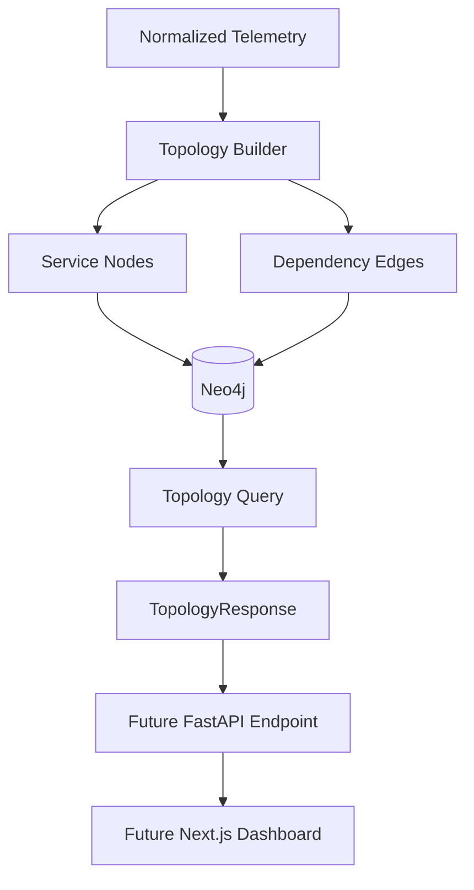
```mermaid
flowchart TD
    NT[Normalized Telemetry] --> TB[Topology Builder]
    TB --> SN[Service Nodes]
    TB --> DE[Dependency Edges]
    SN --> N4J[(Neo4j)]
    DE --> N4J
    N4J --> TQ[Topology Query]
    TQ --> TR[TopologyResponse]
    TR --> API[Future FastAPI Endpoint]
    API --> DASH[Future Next.js Dashboard]
```

The topology layer sits between normalized telemetry and the future RCA / dashboard layers.

### Topology Contract

Two primary graph entities were defined.

**Service Node** — every unique service becomes a node:

```text
Service
├── service_name
├── first_seen
├── last_seen
└── attributes
```

**Dependency Edge** — a relationship between two services:

```text
Source Service
      │
      │ DEPENDS_ON
      ▼
Target Service
```

Dependencies are derived from parent/child service relationships observed within a trace, not from events simply occurring near each other in time:

```text
Trace
│
├── api-gateway   (parent span)
│
└── payment-service (child span)
```

becomes:

```text
api-gateway
      │
      ▼
payment-service
```

This is represented in Neo4j as:

```text
(:Service)-[:DEPENDS_ON]->(:Service)
```

### Topology Construction Rules

| Situation | Result |
|---|---|
| Same service observed repeatedly | Reuse the same `Service` node |
| Different services connected through a valid trace/span relationship | Create a dependency edge |
| Same dependency observed repeatedly | Reuse/update the existing edge |
| Same service as source and target | Reject self-dependency |
| Services only close in time | Do not create a dependency |
| Insufficient relationship information | Do not invent a dependency |

A particularly important design rule: **TraceRCA must not infer a service dependency merely because two services generated telemetry near each other in time.** Topology dependencies require structural evidence from the trace/span relationship.

### Topology Schemas

Two Pydantic models represent the topology.

**`ServiceNode`**

```python
ServiceNode(
    service_name="payment-service",
    first_seen=...,
    last_seen=...,
)
```

Validation ensures `service_name` is not empty, whitespace-only names are rejected, and service names have a maximum length of 255 characters.

**`DependencyEdge`**

```python
DependencyEdge(
    source_service="api-gateway",
    target_service="payment-service",
    first_seen=...,
    last_seen=...,
)
```

Validation ensures the source and target services are each valid, and that source and target cannot be the same service (no `payment-service → payment-service` self-dependency).

**`TopologyResponse`**

```python
TopologyResponse(
    services=[...],
    dependencies=[...],
)
```

`ServiceNode` maps onto a Neo4j node and `DependencyEdge` onto a Neo4j relationship, which is why they are kept as separate models. `TopologyResponse` gives downstream consumers a single representation of the complete service graph.

### Neo4j Infrastructure

Neo4j was added as the graph database for the service topology, running in a Docker container named `tracerca-neo4j`:

| Interface | Address |
|---|---|
| Browser | `localhost:7474` |
| Bolt | `localhost:7687` |

The Neo4j data directory uses a persistent Docker volume, so stopping the container does not remove the stored graph data. Connectivity was verified using the Neo4j Browser and a Bolt connection.

### Neo4j Connection Layer

A dedicated asynchronous Neo4j connection layer was implemented at `backend/app/db/neo4j.py`, using the official Neo4j Python driver to provide asynchronous driver creation, connectivity verification, and connection cleanup.

Configuration lives in `backend/app/core/config.py` and is supplied through environment variables rather than hard-coded credentials. The local `.env` file stays ignored by Git so credentials are never committed to the repository.

### Service-Node Creation / Upsert

Implemented in `backend/app/telemetry/topology_service.py` using Neo4j `MERGE` for idempotent service creation:

```cypher
MERGE (s:Service {
    service_name: $service_name
})
```

If a service doesn't exist, a new node is created:

```text
(:Service {
    service_name: "payment-service",
    first_seen: ...,
    last_seen: ...
})
```

If it already exists, the existing node is reused: `first_seen` is preserved as the earliest observation and `last_seen` is updated to the latest one — so repeated observations never create duplicate service nodes.

### Dependency-Edge Creation / Upsert

Dependency relationships are represented as `(:Service)-[:DEPENDS_ON]->(:Service)` and also use Neo4j `MERGE`:

```text
api-gateway
     │
     │ DEPENDS_ON
     ▼
payment-service
```

The relationship stores `first_seen` and `last_seen`. Repeated observations of the same source and target update the existing relationship rather than creating duplicate edges, and both service nodes must already exist before a dependency relationship is created between them.

```bash
pytest -q tests/test_topology_service.py
```

**1 passed** — confirms Neo4j actually creates a `test-api-service → DEPENDS_ON → test-database-service` relationship, i.e. TraceRCA can create two `Service` nodes, create a `DEPENDS_ON` relationship between them, store `first_seen`/`last_seen`, and use `MERGE` to prevent duplicate dependency edges against a real Neo4j database.

### Topology Construction Pipeline

Implemented in `backend/app/telemetry/topology_builder.py`, which accepts `NormalizedTelemetry` and builds the graph from it:

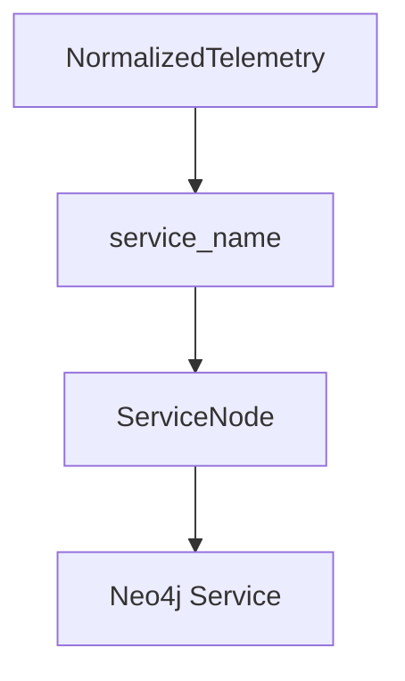
```mermaid
flowchart TD
    NT[NormalizedTelemetry] --> SN[service_name]
    SN --> N[ServiceNode]
    N --> N4[Neo4j Service]
```

Trace parent/child relationships are also converted into service dependencies:

```text
Parent Span
api-gateway
     ↓
Child Span
payment-service
```

becomes:

```text
api-gateway
     │
     │ DEPENDS_ON
     ▼
payment-service
```

The builder does **not** create a dependency when either service name is missing, the events are not trace events, or both spans belong to the same service — ensuring topology relationships are based on meaningful trace structure rather than simple temporal proximity.

### Topology Query / Retrieval

`get_topology()` retrieves two categories of information from Neo4j:

| Category | Fields |
|---|---|
| Services | `service_name`, `first_seen`, `last_seen` |
| Dependencies | `source_service`, `target_service`, `first_seen`, `last_seen` |

```cypher
MATCH (s:Service)
RETURN s.service_name, s.first_seen, s.last_seen
```

```cypher
MATCH (source:Service)-[d:DEPENDS_ON]->(target:Service)
RETURN source.service_name, target.service_name, d.first_seen, d.last_seen
```

The result is returned as a `TopologyResponse`:

```json
{
  "services": [
    { "service_name": "payment-service", "first_seen": "...", "last_seen": "..." }
  ],
  "dependencies": [
    { "source_service": "payment-service", "target_service": "order-service", "first_seen": "...", "last_seen": "..." }
  ]
}
```

This creates a clean boundary between the Neo4j graph representation and future API/dashboard consumers.

### Dashboard Integration Direction

The topology retrieval structure was intentionally designed for the future TraceRCA dashboard:

```mermaid
flowchart LR
    N4J[(Neo4j)] --> GT[get_topology]
    GT --> TR[TopologyResponse]
    TR --> API[FastAPI]
    API --> DASH[Next.js Dashboard]
    DASH --> VIZ[Graph Visualization]
```

The dashboard will eventually visualize chains such as `Frontend → API → Order Service → Payment Service → Database` without the frontend needing to understand Neo4j or Cypher.

### Topology Testing & Verification

Dedicated topology tests were added:

- `tests/test_topology.py`
- `tests/test_topology_service.py`

Coverage includes: `ServiceNode` creation and validation, `DependencyEdge` creation and self-dependency validation, Neo4j service-node upsert, Neo4j dependency-edge upsert, topology construction, topology retrieval, and complete topology integration.

```bash
pytest -q tests/test_topology.py tests/test_topology_service.py
```

**11 tests passed.**

A full regression run was then executed across the entire project:

```bash
pytest -q
```

**92 passed, 6 warnings** — confirming the new Neo4j/topology functionality did not break existing telemetry ingestion, normalization, correlation, or other project functionality. The warnings were dependency deprecation warnings, not test failures.

```mermaid
flowchart TD
    OT[OpenTelemetry] --> ING[Telemetry Ingestion]
    ING --> NORM[Normalization]
    NORM --> CORR[Correlation]
    CORR --> TB[Topology Builder]
    TB --> SN[Service Nodes]
    TB --> DE[Dependency Edges]
    SN --> N4J[(Neo4j)]
    DE --> N4J
    N4J --> TR[TopologyResponse]
    TR --> RCA[Future RCA Engine]
    TR --> DASH[Future Dashboard]
```

Service topology completes the structural foundation required by the later RCA and Graph RAG layers.

### Topology Roadmap

| Task | Status |
|---|---|
| Inspect correlation output and define topology contract | ✅ Complete |
| Define service-node and dependency-edge schemas | ✅ Complete |
| Set up Neo4j infrastructure | ✅ Complete |
| Configure Neo4j connection layer | ✅ Complete |
| Implement service-node creation/upsert | ✅ Complete |
| Implement dependency-edge creation/upsert | ✅ Complete |
| Build topology construction service/pipeline | ✅ Complete |
| Add topology query/retrieval | ✅ Complete |
| Add topology tests + integration verification | ✅ Complete |
| Final verification + documentation closeout | ✅ Complete |

---

Inspect M8 Output & Freeze Anomaly Contract
Do not write code yet. First, we define exactly what TraceRCA considers an anomaly.
1. What M8 currently gives us
Our pipeline now has:
OpenTelemetry
      ↓
Telemetry Ingestion
      ↓
Normalization (M6)
      ↓
Correlation (M7)
      ↓
Service Topology (M8)
      ↓
Neo4j

M8 gives us information such as:
- Services
- Service timestamps
- Service dependencies
- Trace relationships
- Dependency graph
For M9, we use this foundation to detect abnormal behavior.
2. What is an anomaly in TraceRCA?
For Part 1, we'll define an anomaly as:
A telemetry observation whose behavior significantly deviates from the expected behavior of a service.

We'll initially detect three important types:
Anomaly	Example
Latency anomaly	A service normally responds in 100 ms but suddenly takes 900 ms
Error-rate anomaly	A service normally has 1% errors but suddenly reaches 30%
Metric anomaly	CPU normally stays around 40% but suddenly reaches 95%


This is deliberately basic anomaly detection for Part 1.
We are not yet doing sophisticated ML-based anomaly detection.
3. M9 anomaly contract
Every detected anomaly should contain at least:
Anomaly
│
├── anomaly_id
├── service_name
├── anomaly_type
├── timestamp
├── observed_value
├── expected_value
├── severity
└── description

We'll use three anomaly types:
LATENCY
ERROR_RATE
METRIC

And three severity levels:
LOW
MEDIUM
HIGH

4. Detection rules
We'll start with simple, explainable rules.
Latency
Compare the current latency against a baseline.
Example:
Expected latency = 100 ms
Observed latency = 500 ms

The detector determines whether the deviation is large enough to classify it as an anomaly.
Error rate
Calculate:
error_rate =
number of failed requests
-------------------------
total requests

Example:
100 requests
30 errors

error rate = 30%

If this is significantly higher than the baseline, we generate an anomaly.
Metrics
For metrics such as CPU utilization:
Expected CPU = 40%
Observed CPU = 95%

The deviation can trigger a metric anomaly.
5. Important design decision
We should not say:
"Any high value is an anomaly."

Instead:
Observed behavior
       ↓
Compare with baseline
       ↓
Calculate deviation
       ↓
Apply threshold
       ↓
Anomaly?
   ↙       ↘
 YES       NO

This will make the system explainable, which is important later when we connect anomaly detection to RCA.
M9.1 status
So our first step is now conceptually frozen:
TraceRCA detects latency, error-rate, and metric anomalies by comparing observed telemetry behavior against an expected baseline and assigning a severity based on the deviation.


Latency Anomaly Detection
Now we'll implement the first actual detector.
The idea will be:
Trace events
    ↓
Get duration
    ↓
Compare with baseline
    ↓
Calculate deviation
    ↓
Check threshold
    ↓
Anomaly / Normal

Latency Anomaly Detection.
We will keep this step simple and explainable.
1. What are we detecting?
Our normalized trace telemetry already contains:
duration_ms
service_name
timestamp

So for each service, we can compare an observed trace duration with an expected latency baseline.
For example:
Expected latency = 100 ms
Observed latency = 250 ms

The deviation is:
(250 - 100) / 100 × 100 = 150%

That is a significant increase.
2. Rule for M9.3
For our basic detector, let's use a percentage-based threshold:
deviation = |observed - expected| / expected

We'll classify:
Deviation	Severity
< 50%	Normal
50% – <100%	LOW
100% – <200%	MEDIUM
≥ 200%	HIGH


So:
Expected = 100 ms
Observed = 180 ms
Deviation = 80%
→ LOW

Expected = 100 ms
Observed = 250 ms
Deviation = 150%
→ MEDIUM

Expected = 100 ms
Observed = 350 ms
Deviation = 250%
→ HIGH

3. One important edge case
If:
expected_value = 0

we cannot calculate the percentage deviation because that would require division by zero.


Error-Rate Anomaly Detection.
We'll follow the same principle as latency: simple, explainable, threshold-based detection.
1. What are we detecting?
For a service:
total requests = 100
failed requests = 25

The error rate is:
25 / 100 × 100 = 25%

We'll compare the observed error rate with the expected baseline.
2. M9.4 rules
We'll use percentage-point deviation from the expected error rate:
Deviation from baseline	Severity
< 5 percentage points	Normal
5 – <10	LOW
10 – <20	MEDIUM
≥20	HIGH


Example:
Expected error rate = 2%
Observed error rate = 15%

Deviation = 13 percentage points
→ MEDIUM

rror-Rate Anomaly Detection is working correctly.
Your results match the contract:
Test 1 — Error-rate anomaly
Expected = 2%
Observed = 15%

Deviation = 13 percentage points
Severity = MEDIUM

The detector correctly generated an ERROR_RATE anomaly.
Test 2 — Normal
Expected = 2%
Observed = 4%

Deviation = 2 percentage points

Below our 5-point threshold, so:
None

Correct. ✅

Metric Anomaly Detection.
This will handle metrics such as:
- CPU utilization
- Memory utilization
- Request count
- Queue size
- Any other numeric metric from OpenTelemetry
1. Detection rule
Unlike error rate, metrics can have different units, so we'll use relative percentage deviation, just like latency.
deviation = |observed - expected| / expected

We'll use:
Deviation	Result
< 50%	Normal
50% – <100%	LOW
100% – <200%	MEDIUM
≥ 200%	HIGH


For example:
Expected CPU = 40
Observed CPU = 100

Deviation = 150%
→ MEDIUM


Unified Anomaly Detection Service
This is where we'll bring the three detectors together:
Unified Anomaly Detection Service.
The goal is to have one entry point that chooses the correct detector based on the telemetry type.

                 Normalized Telemetry
                         ↓
              Anomaly Detection Service
                  ↙       ↓       ↘
             Latency   Error Rate   Metric
                ↓         ↓          ↓
                    Anomaly


Normalized Telemetry
        │
        ▼
AnomalyDetectionService
        │
        ├── Latency ──────► Latency Detector
        │
        ├── Error Rate ───► Error Detector
        │
        └── Metric ───────► Metric Detector
                              │
                              ▼
                           Anomaly

Automated Tests
Now we'll convert the manual checks we've been doing into proper pytest tests.
We'll test:
- Normal latency
- Low/medium/high latency anomalies
- Invalid latency input
- Normal error rate
- Low/medium/high error-rate anomalies
- Invalid error-rate input
- Normal metrics
- Low/medium/high metric anomalies
- Invalid metric input
- Unified service behavior

### Anomaly Detection and services Roadmap
Step	Status
M9.1 — Inspect M8 output & freeze anomaly contract	✅ DONE
M9.2 — Define anomaly schema	✅ DONE
M9.3 — Latency anomaly detection	✅ DONE
M9.4 — Error-rate anomaly detection	✅ DONE
M9.5 — Metric anomaly detection	✅ DONE
M9.6 — Unified anomaly detection service	✅ DONE
M9.7 — Tests	✅ DONE
M9.8 — Final verification + README	✅ DONE

## Project Structure

```text
TraceRCA-AI/
├── backend/
│   ├── __init__.py
│   ├── app/
│   │   ├── __init__.py
│   │   ├── main.py
│   │   ├── api/
│   │   │   └── routes/
│   │   │       └── health.py
│   │   ├── cache/
│   │   │   ├── dependencies.py
│   │   │   └── redis_client.py
│   │   ├── core/
│   │   │   └── config.py
│   │   ├── db/
│   │   │   ├── base.py
│   │   │   ├── database.py
│   │   │   ├── models.py
│   │   │   └── neo4j.py
│   │   └── telemetry/
│   │       ├── models.py
│   │       ├── tracing.py
│   │       ├── normalizers.py
│   │       ├── topology_service.py
│   │       └── topology_builder.py
│   └── alembic/
│       ├── env.py
│       └── versions/
├── tests/
│   ├── test_health.py
│   ├── test_database_connection.py
│   ├── test_redis.py
│   ├── test_tracing.py
│   ├── test_telemetry_models.py
│   ├── test_ingestion_service.py
│   ├── test_telemetry_api.py
│   ├── test_telemetry_integration.py
│   ├── test_normalized_telemetry.py
│   ├── test_trace_normalizer.py
│   ├── test_log_normalizer.py
│   ├── test_metric_normalizer.py
│   ├── test_normalization_service.py
│   ├── test_correlation.py
│   ├── test_topology.py
│   └── test_topology_service.py
├── docs/
├── scripts/
├── .env.example
├── .gitignore
├── alembic.ini
├── pyproject.toml
├── requirements.txt
└── README.md
```

---

## Getting Started

> **Prerequisites:** Python, PostgreSQL, Redis, Docker (for Neo4j).

```bash
# 1. Install dependencies
pip install -r requirements.txt

# 2. Configure environment variables
cp .env.example .env

# 3. Apply database migrations
alembic upgrade head

# 4. Start Neo4j (service topology)
docker start tracerca-neo4j
# Browser: http://localhost:7474   Bolt: localhost:7687

# 5. Run the API
uvicorn backend.app.main:app --reload
```

### Troubleshooting (Windows)

If `docker` commands aren't recognized in PowerShell, add Docker to the `PATH` for the current session:

```powershell
$env:Path += ";C:\Program Files\Docker\Docker\resources\bin"
```

## Testing

```bash
# Run the full test suite
pytest -q

# Run the telemetry ingestion tests
pytest -q tests/test_ingestion_service.py tests/test_telemetry_api.py

# Run the OpenTelemetry integration test
pytest -q tests/test_ingestion_service.py tests/test_telemetry_integration.py

# Run the normalization tests
pytest -q tests/test_normalized_telemetry.py tests/test_trace_normalizer.py tests/test_log_normalizer.py tests/test_metric_normalizer.py tests/test_normalization_service.py

# Run the correlation tests
pytest -q tests/test_correlation.py

# Run the topology tests
pytest -q tests/test_topology.py tests/test_topology_service.py
```


#docker issue command

(.venv) PS C:\Users\Kuldeeep Singh\TraceRCA-AI> $env:Path += ";C:\Program Files\Docker\Docker\resources\bin"